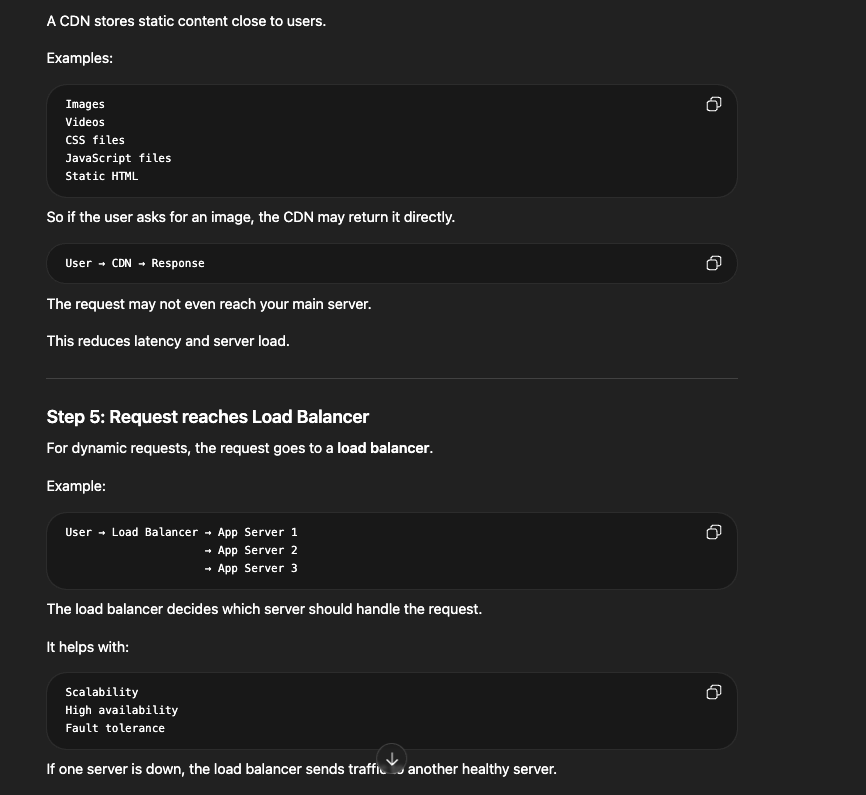
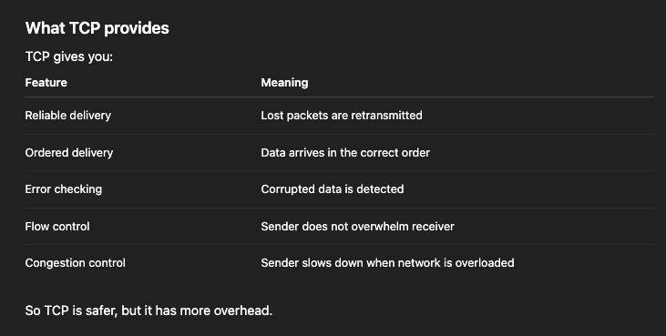

- Mostly we only need surface understanding of networking concepts.
- But understanding these fundamentals will help you to make better decisions even if minute details are not going to be tested in the interviews.

# Basic Building Blocks

## IP Address
- Every machine has an IP (like a home address).
- IPv4: 192.168.1.1
- IPv6: Longer, newer format
- IP adress, we can use to identify devices over the network

## DNS (Domain Name System)
- Humans use: google.com, while machines use: 142.250.x.x, DNS translates google.com -> IP Address
- In system design:-
DNS lookup adds latency while cached DNS improves speed.

## Ports
A machine can run many services:
- HTTP -> port 80
- HTTPS -> port 443
- DB -> 5432 (Postgres)

IP = Machine and Port = Specific Service on that machine


## Networking Layers
- In the networking stack - we only need to care about the three key layers: Layer 7: Application layer, leyer 4: transport layer and layer 3: network layer

- Layer 3: Network Layer
At this layer is IP, the protocol that handles routing and addressing. It's responsible for breaking data into packets, handling packet forwarding between networks and providing best effort delivery to any destination IP address on the network.


- Layer 4: Transport Layer
At this layer, we have TCP, UDP etc. which provide end-to-end communication services. Think of them like layers that provides features like reliability, ordering and flow control on top of the network layer.

- Layer 7: Application Layer
At the final layer we have application protocols like DNS, HTTP, Websockets, WebRTC. These are common protocols that build on top of TCP (or UDP, in case of WebRTC) to provide a layer of abstraction for different type of data typically associated with web applications.


## Request Flow in a Real System

Let's trace a request, in brief, when a user types `amazon.com` in the browser:

1. DNS lookup gets the IP address.
2. TCP handshake sets up the connection.
3. TLS handshake secures the connection if HTTPS is used.
4. Browser sends the request.
5. CDN may serve static content.
6. Load balancer routes dynamic requests.
7. Application server processes the request.
8. Response is sent back to the user.

System design insight: each step adds latency, so optimizing these steps is important.

### Explanation

1. User enters a URL, such as `amazon.com`.

2. The URL gets converted into an IP address through DNS (Domain Name System). Without DNS, users would have to remember IP addresses.

3. The browser creates the connection. After getting the IP address, the browser connects to the server.


4. The request may reach a CDN.

Many servers use a CDN (Content Delivery Network). A CDN stores static content close to users, such as:

- Images
- Videos
- CSS files
- JavaScript files
- Static HTML



5. Dynamic requests reach the load balancer.

For dynamic requests, the request goes to a load balancer. The load balancer decides which server should handle the request.

It helps with scalability, high availability, and fault tolerance. If one server is down, the load balancer sends the request to another healthy server.

6. The application server handles the request.

The application server receives something like `GET /products/123` and runs the business logic. It may talk to a cache or database.

First, it may check the cache. If the data is found there, it is a cache hit. If the data is not found, it is a cache miss, and the application server queries the database.

7. The response goes back to the user.


## Network Layer Protocols
Network layer protocols are responsible for moving packets from one machine to another across networks (routing and addressing is the responsibility of network layer).
In the OSI model, this is layer 3.

When a request is sent from a machine, it moves through the layers like this:

```text
Application layer: HTTP request / app data
        |
Transport layer: TCP / UDP
        |
Network layer: IP
        |
Data link layer: Ethernet / Wi-Fi
        |
Physical layer: cables / radio signals
```

### The Network Layer Answers

- Where should this packet go?
- Which path should it take?
- How do we identify the destination machine?

This layer is dominated by the IP protocol, which is responsible for routing and addressing.

### IP (Internet Protocol)

IP is the most important network layer protocol. IP provides addressing and routing.

Example IP addresses:

- IPv4: `192.168.1.10`
- IPv6: `2001:db8::1`

When your browser sends a request, IP helps deliver the request from your device to the server.

Example path:

```text
Your laptop -> Router -> ISP -> Internet -> Server
```

IP does not guarantee delivery. It provides best-effort delivery.
This is why TCP exists above IP to provide reliability.

### IPv4 vs IPv6

#### IPv4
- IPv4 is older and very common.
- Example: 142.250.190.78
- IPv4 has limited address space, so we use things like NAT
- NAT helps by letting many private devices share one public address.

#### IPv6
- Newer version with much larger address space.
- IPv6 was created because internet needed more addresses.

### ICMP (Internet Control Message Protocol)

ICMP is another important network layer protocol.
It is mainly used for network diagnostics and error reporting.

Common examples:

- `ping` uses ICMP to check if a machine is reachable.
- `traceroute` uses ICMP-like behavior to show the path packets take through the network.

ICMP is not used to send application data like HTTP requests.
It helps network devices report problems, such as unreachable hosts or expired packets.

System design insight: ICMP is useful for debugging network reachability, but production systems usually rely on application-level health checks for service availability.


## Transport Layer Protocols
- The transport layer is where we establish a end-to-end communication between applications and it sits between network layer and application layer. Its job is to move the data between two processed running on different machines.
- For example, client IP is 10.0.0.5 and port is 53000, then the IP address identifies the machine and port identifies the application running on that machine.
- The three primary protocols at this layer are TCP, UDP and QUIC.
- For most of the system design interviews, the real choice is between TCP and UDP. QUIC is a new protocol that provides same benefits of TCP with some modernization and performance benefits.

### TCP
- TCP stands for 'Transmission Control Protocol'.
- It is used when you care about: Reliability, Ordering, Correctness and Complete delivery.
- TCP creates a connection before sending the data:-
```text
client -> server: SYN (synchronization)
server -> client: SYN-ACK (synchronization + acknowledgement)
client -> server: ACK (acknowledgement)
```



- Most normal backend systems use TCP.
- Examples: HTTPS, REST APIs, Websockets, Databases, SSH, Email, Payment Systems, Message Queues etc
- In system design, almost most APIs are using HTTP/HTTPS over TCP.
- Example: Mobile App -> Load Balancer -> Backend API -> Database (this is always TCP)

TCP tradeoffs:
- TCP gives reliability, but it adds extra overhead because of connection setup and acknowledgements.
- TCP guarantees ordering, but one slow or lost packet can delay later packets (if one packet is lost - then other packets may have to wait until this lost packet is transmitted)
- TCP is great for correctness, but it may be slower than UDP for real-time systems like gaming, live video or voice calls.

### UDP
- UDP stands for 'User Datagram Protocol'.
- It is used when you care more about speed and low latency than guaranteed delivery.
- UDP does not create a connection before sending the data.
- UDP does not guarantee reliability, ordering or complete delivery.
- If a packet is lost, UDP does not automatically retransmit it.

- Examples: DNS, Video Streaming, Gaming, Voice Calls, WebRTC etc
- In system design, UDP is used when losing some data is better than waiting too long.
- Example: In a live video call, it is better to drop one frame than pause the whole call.

UDP tradeoffs:
- UDP is faster than TCP because it has less overhead.
- UDP is good for real-time systems, but the application may need to handle missing or out-of-order packets.
- UDP is not a good choice when correctness is very important, like payments, databases or normal backend APIs.

### QUIC
- QUIC is a newer transport protocol built on top of UDP.
- It is used by HTTP/3 and gives TCP-like reliability with better performance in many cases.
- In system design, you can think of QUIC as a modern protocol used to reduce connection setup time and improve performance on unreliable networks.
