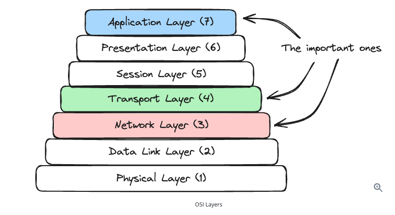

- Mostly we only need surface understanding of networking concepts.
- But understanding these fundamentals will help you to make better decisions even if minute details are not going to be tested in the interviews.

# Basic Building Blocks

## IP Address
- Every machine has an IP (like a home address).
- IPv4: 192.168.1.1
- IPv6: Longer, newer format
- IP adress, we can use to identify devices over the network

## DNS (Domain Name System)
- Humans use: google.com, while machines use: 142.250.x.x, DNS translates google.com -> IP Address
- In system design:-
DNS lookup adds latency while cached DNS improves speed.

## Ports
A machine can run many services:
- HTTP -> port 80
- HTTPS -> port 443
- DB -> 5432 (Postgres)

IP = Machine and Port = Specific Service on that machine

## Networking Layers
- In the networking stack - we only need to care about the three key layers: Layer 7: Application layer, leyer 4: transport layer and layer 3: network layer

- Layer 3: Network Layer
At this layer is IP, the protocol that handles routing and addressing. It's responsible for breaking data into packets, handling packet forwarding between networks and providing best effort delivery to any destination IP address on the network.

- Layer 4: Transport Layer
At this layer, we have TCP, UDP etc. which provide end-to-end communication services. Think of them like layers that provides features like reliability, ordering and flow control on top of the network layer.

- Layer 7: Application Layer
At the final layer we have application protocols like DNS, HTTP, Websockets, WebRTC. These are common protocols that build on top of TCP (or UDP, in case of WebRTC) to provide a layer of abstraction for different type of data typically associated with web applications.

## Protocols (How communication happens)

