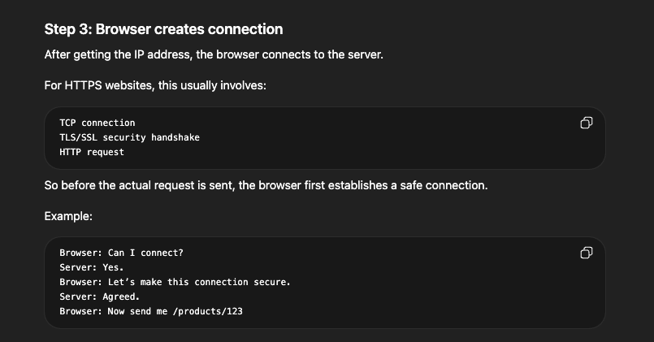

- Mostly we only need surface understanding of networking concepts.
- But understanding these fundamentals will help you to make better decisions even if minute details are not going to be tested in the interviews.

# Basic Building Blocks

## IP Address
- Every machine has an IP (like a home address).
- IPv4: 192.168.1.1
- IPv6: Longer, newer format
- IP adress, we can use to identify devices over the network

## DNS (Domain Name System)
- Humans use: google.com, while machines use: 142.250.x.x, DNS translates google.com -> IP Address
- In system design:-
DNS lookup adds latency while cached DNS improves speed.

## Ports
A machine can run many services:
- HTTP -> port 80
- HTTPS -> port 443
- DB -> 5432 (Postgres)

IP = Machine and Port = Specific Service on that machine

## Networking Layers
- In the networking stack - we only need to care about the three key layers: Layer 7: Application layer, leyer 4: transport layer and layer 3: network layer

- Layer 3: Network Layer
At this layer is IP, the protocol that handles routing and addressing. It's responsible for breaking data into packets, handling packet forwarding between networks and providing best effort delivery to any destination IP address on the network.

- Layer 4: Transport Layer
At this layer, we have TCP, UDP etc. which provide end-to-end communication services. Think of them like layers that provides features like reliability, ordering and flow control on top of the network layer.

- Layer 7: Application Layer
At the final layer we have application protocols like DNS, HTTP, Websockets, WebRTC. These are common protocols that build on top of TCP (or UDP, in case of WebRTC) to provide a layer of abstraction for different type of data typically associated with web applications.

## Request Flow in a Real System

Let's trace a request, in brief, when a user types `amazon.com` in the browser:

1. DNS lookup gets the IP address.
2. TCP handshake sets up the connection.
3. TLS handshake secures the connection if HTTPS is used.
4. Browser sends the request.
5. CDN may serve static content.
6. Load balancer routes dynamic requests.
7. Application server processes the request.
8. Response is sent back to the user.

System design insight: each step adds latency, so optimizing these steps is important.

### Explanation

1. User enters a URL, such as `amazon.com`.

2. The URL gets converted into an IP address through DNS (Domain Name System). Without DNS, users would have to remember IP addresses.

3. The browser creates the connection. After getting the IP address, the browser connects to the server.

4. The request may reach a CDN.

Many servers use a CDN (Content Delivery Network). A CDN stores static content close to users, such as:

- Images
- Videos
- CSS files
- JavaScript files
- Static HTML

5. Dynamic requests reach the load balancer.

For dynamic requests, the request goes to a load balancer. The load balancer decides which server should handle the request.

It helps with scalability, high availability, and fault tolerance. If one server is down, the load balancer sends the request to another healthy server.

6. The application server handles the request.

The application server receives something like `GET /products/123` and runs the business logic. It may talk to a cache or database.

First, it may check the cache. If the data is found there, it is a cache hit. If the data is not found, it is a cache miss, and the application server queries the database.

7. The response goes back to the user.

## Network Layer Protocols

