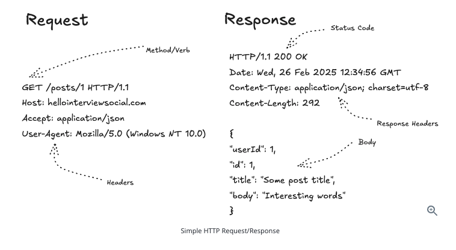

# Application Layer Protocols

- This is the layer where most developers spend their time.
- Application layer protocols are used by applications to communicate with each other over the network (these protocols define how applications communicate)
- In the OSI model, this is layer 7.
- These protocols usually run on top of transport layer protocols like TCP, UDP or QUIC.

In system design interviews, application layer protocols matter because they decide how clients and services exchange data.

Examples:

- Browser talking to backend API
- Mobile app talking to server
- Service talking to another service
- Client receiving real-time updates

## HTTP / HTTPS

- HTTP stands for 'Hypertext Transfer Protocol'.
- It is the most common protocol used by web applications and APIs.
- HTTPS is HTTP with encryption using TLS.
- Most websites, REST APIs and normal backend systems use HTTP/HTTPS.
- It's a **request-response** protocol where client sends request to servers, and servers respond with the requested data (it is a stateless protocol, meaning that each request is indepedent and server does not need to maintain any information about the previous requests)



Example:

```text
Client -> HTTPS request -> Backend API
Backend API -> HTTPS response -> Client
```

System design insight: HTTPS is the default choice for public APIs because it provides encryption and security.

## REST

- While HTTP can be used directly to build websites , oftentimes system designs are concerned with the communication between services via APIs. For creating these APIs we have 3 main paradigms: REST, GraphQL and gRPC.
- REST stands for 'Representational State Transfer' (REST is not exadtly a protocol. It is an API design style built on HTTP)
- The core principal of REST is that clients are often performing simple operations against resources.
- REST is a common style for designing APIs over HTTP.
- It usually uses HTTP methods like GET (read data), POST (create data), PUT (replace data), PATCH (update partial data) and DELETE (delete data).
- REST APIs usually expose resources using URLs.

Example:

```text
GET /users/123
POST /orders
DELETE /cart/items/10
```

- REST is simple, widely used and easy to cache.
- In system design interviews, REST is usually the default API style unless there is a reason to choose something else.

REST tradeoffs:
- REST is simple and easy to understand.
- REST can over-fetch or under-fetch data.
- REST works well for most normal client-server applications.

## GraphQL

- GraphQL is an API query language built over HTTP (API query language like SQL but it is on API instead of database) - GrapghQL is built to query an API.
- Instead of having many fixed endpoints, the client can ask for exactly the data it needs.
- GraphQL is useful when different clients need different shapes of data.

Example:

```text
Client asks for:
user (id: "123"){
  name
  orders {
    id
    price
  }
}
```

- GraphQL can reduce over-fetching (getting too much data) and under-fetching (needing many API calls)
- It is commonly used when frontend teams need flexibility.

GraphQL tradeoffs:
- GraphQL gives clients more control over the data they request.
- GraphQL can make caching and authorization more complex.
- GraphQL is useful for complex frontend-heavy applications, but REST is often simpler for normal APIs.

## gRPC

- gRPC is used for fast service-to-service communication. It usually runs over HTTP/2 + TCP
- It is commonly used for service-to-service communication.
- gRPC usually uses Protocol Buffers instead of JSON. REST usually sends JSON but gRPC sends compact binary data, which is faster and smaller.
- It is faster and more compact than normal JSON over HTTP.

Example:

```text
Order Service -> gRPC call -> Payment Service
Payment Service -> gRPC response -> Order Service
```

gRPC tradeoffs:
- gRPC is not as browser-friendly as REST.
- For interviews: use REST/HTTP for public APIs and use gRPC for internal service-to-service communication.

## Server-Sent Events (SSE)

- Server-Sent Events allow the server to push updates to the client over HTTP (as its name implies - it allows the server to push updates to the client)
- SSE is one-way communication: server to client (unlike websockets where the communication us from client to server and server to client)
- It is useful when the client only needs to receive updates.

Examples:

- Live notifications
- Live score updates
- Progress updates
- Event feeds

SSE tradeoffs:
- SSE is simpler than WebSockets.
- SSE works well for one-way real-time updates.
- SSE is not a good fit when the client also needs to send frequent real-time messages back to the server.

## WebSockets

- WebSockets provide a long-lived two-way connection between client and server (a persistent 2-way communication between client and server) -> (client <-> server - continous 2-way communication)
- After the connection is created, both client and server can send messages anytime.
- WebSockets are useful for real-time bidirectional communication.

Examples:

- Chat apps
- Multiplayer games
- Collaborative editing
- Live dashboards

WebSocket tradeoffs:
- WebSockets are good for real-time two-way communication.
- WebSockets require managing long-lived connections.
- WebSockets can be harder to scale than simple HTTP request-response APIs.

## WebRTC

- WebRTC (Web Real Time Communication) is used for real-time peer-to-peer communication.
- It is commonly used for audio calls, video calls and screen sharing.
- WebRTC often uses UDP because low latency is more important than perfect delivery.

Examples:

- Video calls
- Voice calls
- Screen sharing
- Peer-to-peer data transfer

WebRTC tradeoffs:
- WebRTC is good for very low-latency real-time communication.
- WebRTC is more complex because it needs NAT traversal using ICE, STUN and TURN.
- WebRTC is a good choice for video/audio calls, but not for normal backend APIs.

## REST vs SOAP

- REST and SOAP are both used to build APIs.
- REST is usually simpler and more common in modern web systems.
- SOAP is older, stricter and commonly seen in enterprise systems, banking systems and legacy systems **(SOAP is a protocol with strict rules. It usually sends XML messages)**.

REST:
- REST usually uses HTTP methods like GET, POST, PUT and DELETE.
- REST commonly sends data as JSON.
- REST is lightweight and easy to use from browsers, mobile apps and backend services.

SOAP:
- SOAP is a protocol with strict rules.
- SOAP usually sends data as XML.
- SOAP has built-in standards for security, transactions and formal contracts.

Easy way to remember:
- REST is like a simple web API using URLs and JSON.
- SOAP is like a formal contract-based API using XML.

Interview answer:
- Use REST for most modern APIs because it is simple, lightweight and widely supported.
- Use SOAP when working with legacy enterprise systems or when strict contracts and standards are required.

## Quick Comparison

```text
HTTP/HTTPS   -> Normal websites and APIs
REST         -> Simple resource-based APIs
SOAP         -> Strict contract-based enterprise APIs
GraphQL      -> Flexible frontend-driven APIs
gRPC         -> Fast service-to-service communication
SSE          -> One-way server to client updates
WebSockets   -> Two-way real-time communication
WebRTC       -> Peer-to-peer audio/video/data communication
```

System design insight: start with HTTP/REST for normal APIs, use gRPC for internal service communication, SSE/WebSockets for real-time updates, and WebRTC for peer-to-peer audio/video use cases.
