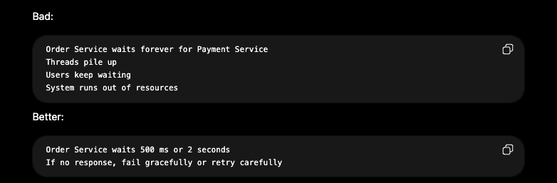

## Regionalization & Latency
- Think of it as: where should my servers and data live so users get fast responses?
- If a user is in India and it has to talk to server in the US, the request physically travels a long distance (even with the speed of light, it can add unavoidable latency)
- In system design - it matters because latency is not caused by slow code or slow database. It can come from a network distance.

### Important Idea: Data Locality - performance is best when the data is close to the computation that needs it.

## CDNs
- A CDN or content delivery network, is a network of servers placed around the world. These CDN servers are often called edge locations. They are closed to users and can serven cached content quickly.
### CDNs are commonly used when the data is cacheable and queried globally. So, the user get the content faster and your backend gets less traffic.
- Example: for YouTube thumbnails, a CDN is great. For "Kapil's bank balance," a CDN caching is dangerous unless done with strict private caching controls.

## Regional Partitioning
- Regional partitioning means splitting your system by geography.
- Instead of one giant global system, you may have US Region, Europe Region, India Region, Southeast Asia Region.
- Each region has its own servers, caches and databases.
- Regional paritioning improves: latency, scalability, fault isolation, local compliance.
- But it makes these harder: cross-region consistency, global search, user migration between regions etc.

## Timeouts
- A timeout means - I will wait only this long for a response. After that, I stop waiting.
- Without timeouts, one slow dependency can make your system hang forever.

- AWS builder library recommends setting timeouts for remote calls, including connection timeouts and request timeouts, because waiting too long consumes resources, while setting timeouts too low can cause un-ncessary retries and backend loads.