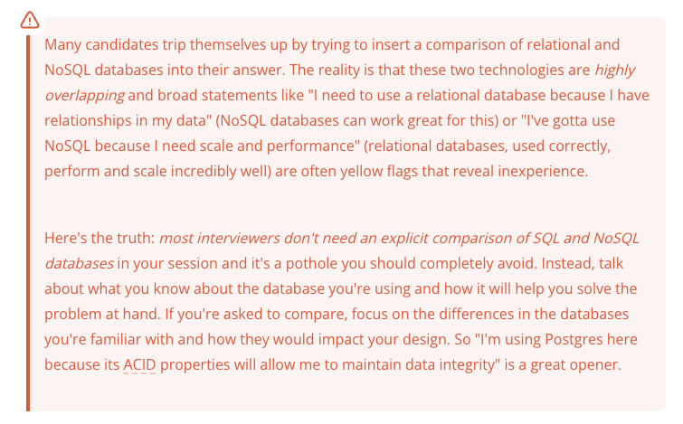
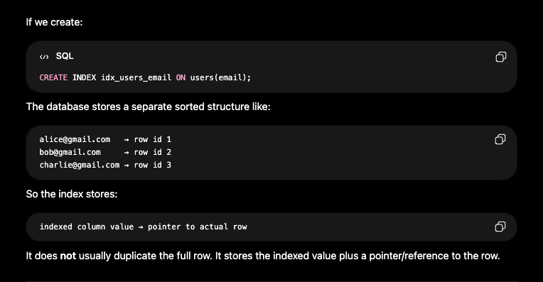

- System design involves assembling the most effectivce building blocks to solve a problem, so it's crucial to have a good understanding of most commonly used building blocks.

## Core Database
- Almost all system design problems will require you to store some data and you're most likely going to be storing it in a database (or Blob Storage).
- While there are many different types of databases, the most common are relational databases (e.g. Potgres) and NoSQL databases (e.g. DynamoDB) - recommendation is picking one of them for the interview.
- If you're taking predominently product design interviews - recommendation is picking a relational database.
- If you're taking predominentely infrastructure design interviews - recommendation is picking a NoSQL database.

- Choosing SQL or NoSQL is a choice - but whatever you are choosing - choose with a reason - choose it because it is solving some problem of yours. Like "I am using Postgres here because its ACID properties will allow me to maintain data integrity."

### Relational Databases

- Relational databases (sometimes called RDMS or Relational Database Management Systems) are the most common types of database. 
- They are often used for transactional data (e.g. user records, order records etc.) and are typically the defaukt choice for product design interviews.
- Relational databases stores your data into the tables - which are composed of rows and columns.
- Each row represents a single record and each column represents a single field on that record.
- For example, a 'user' table might have a 'name' column and an 'email' column.
- Relational databases are oftem queried using SQL - a declarative language for querying data.

#### Things to know about relational databases
1. **SQL joins -** Joins are the way of combining data from multiple tables. For example, if you have a users tabel and a posts table, you might want to query for all the posts for a particular user. This is important for querying data and SQL databases can support arbitrary joins between tables. But joins can also be a performance bottleneck in your system so minimize them where possible.

2. **Indexes -** Indexes are a way of storing the data that makes it faster to query. 
- For example if you have 'users' table with 'name' column, you might create an index on 'name' column - this would allow you to query for 'users' by name much faster than if you didn't have an index.
- Indexes are often implemented using a **B-Tree** or a **Hash-Table**.
- Think of indexes like a sorted lookup structure.
- It does not usually duplicate the full row. it stores the indexed value plus a pointer/reference to that row.

