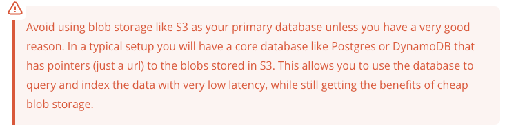
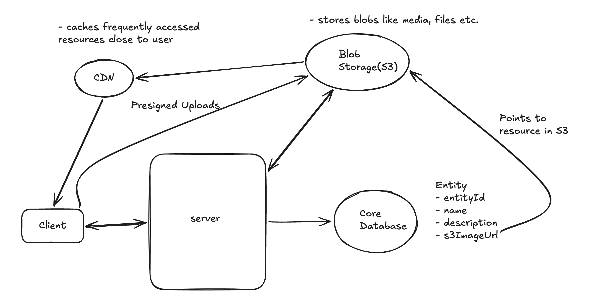

## BLOB Storage - BLOB means - Binary Large Object
- Blob storage is there to store things like - Images, Videos, Audio Files, PDFs, Backups, Logs, Large text or binary files.
- Unlike a database table, blob storage does not store data in rows and columns. It stores files as objects inside containers or buckets.
- Storing these large blobs in database is both ineffiecient and expensive and should be avoided when possible.
- Instead we should use amazon S3 or Google Cloud Storage.

#### Blob storage are simple. You upload a blob of data and data is stored and get back a URL. You can use this URL to download the blob of data.

#### Here are common examples of when to use blob storage:-
- Design YouTube: Store the videos in blob storage, store metadata in a database.
- Design Instagram: Store images and videos in blob storage, store metadata in a database.
- Design Dropbox: Store files in blob storage, store metadata in a database.

A very common setup while dealing with large binary artifacts looks like this:-

#### To upload:-
- When a client wants to upload a file, they request a pre-signed URL from from the server.
- The server returns the pre-signed URL to the client, recording it in the database.
- The client uploads the file to the pre-signed URL.
- The blob storage triggers the notification to the server that the upload is complete and the status is updated.

#### To download:-
- The client requests a pre-signed file from the server and are returned a presigned URL.
- The client uses that pre-signed URL to download the file via the CDN.

### Things you should know about blob storage:-
1. **Durability:** Blob storage services are designed to be highly durable. 
2. **Scalability:** Can store unlimited amount of data and can handle an unlimited number of requests.
3. **Cost Effective:** Blob storage is very cost effective. They are much cheaper than storing large blobs of data in a traditional database.
4. **Security:** Built in security features like encryption at rest and transit. They also have access control features that allow you to control who can access your data.
5. **Upload and download directly from the client:** We can use pre-signed URLs to grant access to temprarily either upload or download the blob of data.
6. **Chuking:** When uploading large files, it's common to use chunking to upload the file in smaller pieces. This allows you to resume an upload if it fails partway through, and it also allows you to upload the file in parallel. This is specially useful for large files, where uploading the entire file at once take time.

- Modern blob storage services like S3 - support chunking out of the box via MULTIPART UPLOAD API.  

#### Amazon S3, Google Cloud Storage and Azure Blob are the most popular blob storage services.
