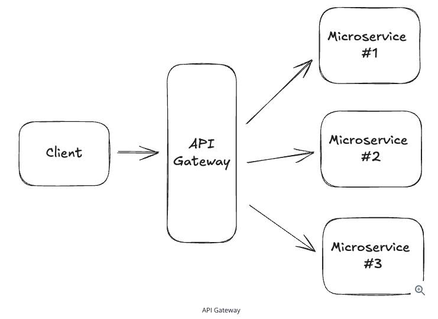

## API Gateway
### What is an API gateway and when should you use it?

- Especially in microservices architecture, an API gateway sits in front of your system and is responsible for routing incoming requests to the appropriate backend service.
- For example, if the system receives a request to 'GET /users/123', the API gateway would route that request to the 'users' service and return the response to the client. 
- The gateway is also responsible for handling other concerns like **authentication**, **rate-limiting**, and **logging**.
- In nearly all product design style system design interviews, it is a good idea to include an API gateway in your design as the first point of contact for your clients.

- The most common API gateways are AWS API Gateway, Kong, Apigee. It is also uncommon to have an nginx or apache webserver as your API Gateway.