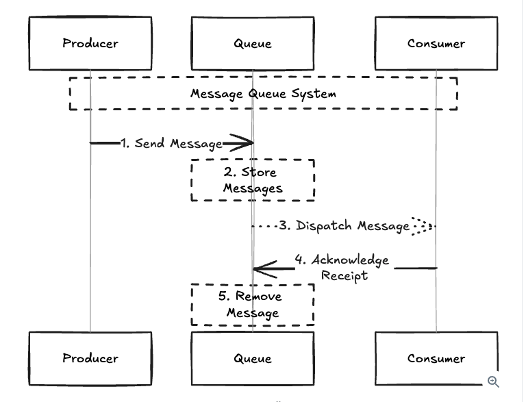

## Queue (One of the most important topic)
#### What are queues and when should you use them?

- We can understand this like a temporary storage system for tasks/messages.
- Basic idea: Producer -> Queue -> Consumer/Worker
- Example: User Service -> SQS Queue -> Email Worker (the producer does not directly call the worker, it puts a message into the queue, and the worker processes it later)

> [!IMPORTANT]
> A queue's function is to smooth out the load on the system. If I get a spike of 1000 requests but can handle 200 requests per second, 800 requests will wait in the queue before being processed - but they are not dropped!
> Queues also decouple the producer and the consumer of a system, allowing you to scale them independently.
> I can bring services behind a queue down and back up with negligible impact.

#### Common use cases for queues:

1. **Buffer for Bursty Traffic:** In a ride-sharing application like Uber, queues can be used to manage sudden surges in ride requests.
    - During peak hours or special events, ride requests can spike massively.
    - A queue buffers these incoming requests, **allowing the system to process them at a manageable rate** without overloading the server or degrading the user experience.

2. **Distribute Work Across a System:** In a cloud-based photo processing service, queues can be used to distribute expensive image processing tasks.
    - When a user uploads photos for editing or filtering, these tasks are placed in a queue.
    - Different worker nodes pull tasks from the queue, ensuring even distribution of workload and efficient use of computing resources.

#### Things to know about queues:

1. **Message Ordering:** Most queues are FIFO (first in, first out), meaning the messages are processed in the order they were received.
    - However, some systems like **Kafka** provide more specific ordering guarantees, such as ordering within a partition.

2. **Retry Mechanisms:** Many queues have built-in retry mechanisms that attempt to redeliver a message a certain number of times before considering it a failure.

3. **Dead Letter Queues:** DLQs are used to store messages that can't be processed. They are useful for debugging and auditing, as they allow you to inspect messages that failed to process and understand why they failed.
