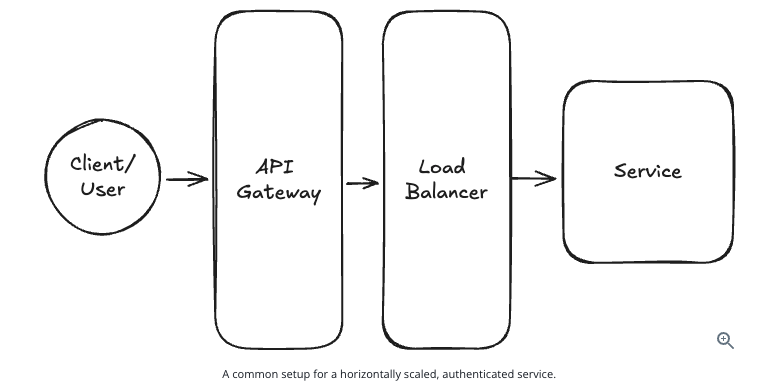

## Load Balancer

### What is a load balancer and when should you use it?

- Many system design problems will ask you to handle a large amount of traffic.
- When you are dealing with a large amount of traffic, you want to distribute that traffic across multiple servers or machines. This is called horizontal scaling, and it helps avoid overloading any single machine or creating a hotspot.
- This is where a load balancer comes in. It acts like a black box that distributes the load across your system.

- Note that sometimes you will need to have specific features from your load balancer, like sticky sessions or persistent connections.
- The most common decision to make is whether to use an L4 (Layer 4) or L7 (Layer 7) load balancer.
- **You can somewhat shortcut this decision with a simple rule of thumb: if you have persistent connections like WebSockets, you will likely want to use an L4 load balancer. Otherwise, an L7 load balancer offers greater flexibility in routing traffic to different services while minimizing the connection load downstream.**

#### What are the most common load balancers?

- The most common load balancers are **AWS Elastic Load Balancer** (a hosted offering from AWS), NGINX (an open source web server frequently used as a load balancer), and HAProxy (a popular open source load balancer).
