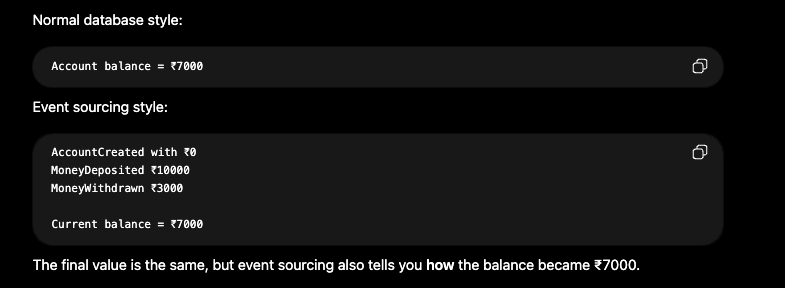
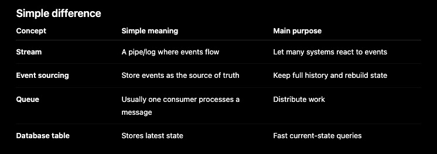
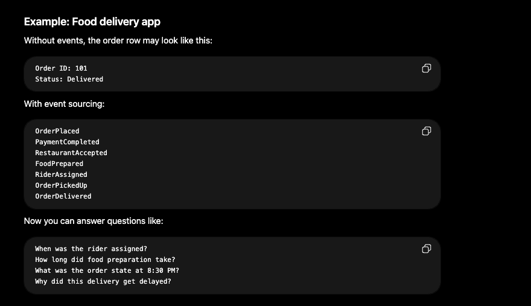
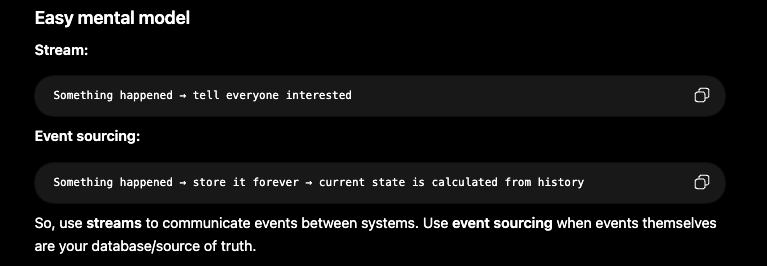

## Streams / Event Sourcing

### What are streams and when should you use them?

- A stream is a continuous flow of events.
- An event is something that happened in the system.

### 1. Stream / Event Stream

- A stream is a continuous flow of events.
- Think of it like a WhatsApp group where messages keep coming, and different people can read and react to them.
- In system design, events are like `OrderPlaced`, `PaymentCompleted`, `UserLoggedIn`, etc.

Example:

```text
User places order
        ↓
Event: OrderPlaced
        ↓
Kafka / Kinesis / EventBridge topic
        ↓
Inventory Service updates stock
Email Service sends confirmation
Analytics Service tracks order
Delivery Service starts shipment
```

- Here, the order service does not directly call other services. It just publishes an event, and other services consume it.

### 2. Event Sourcing

- Event sourcing means you store every change as an event, instead of only storing the latest state.
- The current state is rebuilt by replaying all past events in order.
- AWS describes it as storing state-changing events in an append-only event store, which gives auditability, traceability, and the ability to reconstruct past state.



### Difference:



### Food Delivery App Example



### When to use streams

- Use streams when multiple systems need to react to the same action.

Good examples:

- `OrderPlaced` -> Inventory update, email service, analytics
- `PaymentCompleted` -> Invoice, notification, reward points

### When to use event sourcing

- When history matters as much as the final state.



### Common streaming technologies are Kafka, Flink, Kinesis etc
