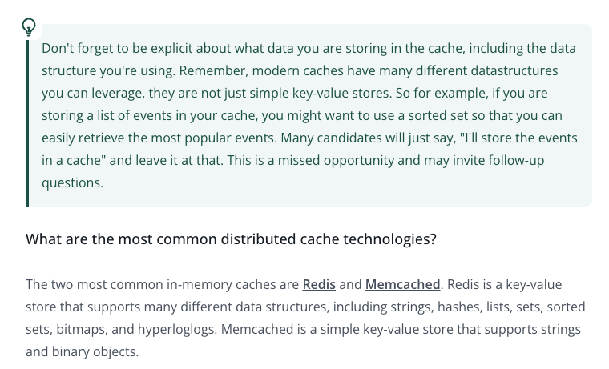

## What is a distributed cache and when should you use it?

- In most system design interviews, you will be tasked with scaling a system and reducing latency.
- One common way to do this is to use a distributed cache.
- A cache is just a server, or cluster of servers, that stores data in memory.
- Caches are great for storing data that is expensive to compute or retrieve from the database.

### Distributed cache

A distributed cache is a cache spread across multiple machines.

- It stores frequently used data in memory so applications can read it quickly without hitting the database every time.
- Simple flow: App Server -> Distributed Cache -> Database
- Example tools: Redis Cluster, Memcached, Amazon ElastiCache, Azure Cache for Redis, and Google Memorystore.

#### What data should be cached?

- Cache data that is read frequently, expensive to compute, not changing every second, and safe to be slightly stale.
- Examples: homepage feed, popular posts, search results, access tokens, etc.

#### TTL

- TTL stands for Time to Live.
- Cached data usually has an expiry time. For example, a cached value might expire after 10 minutes.

