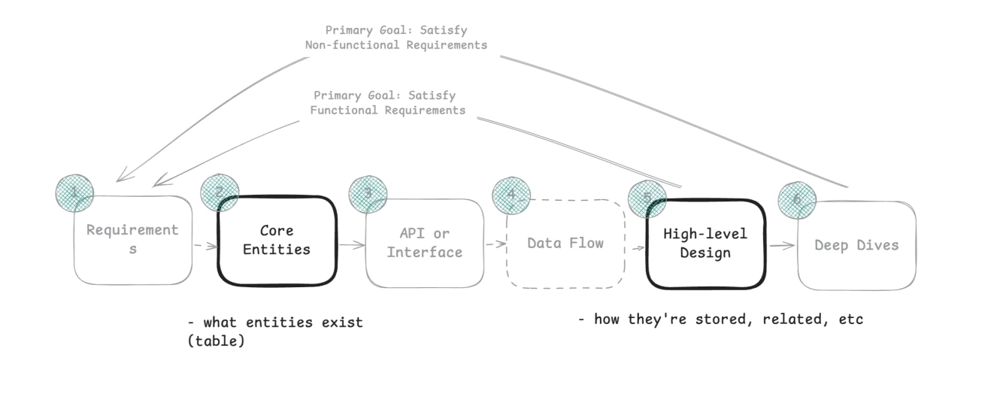
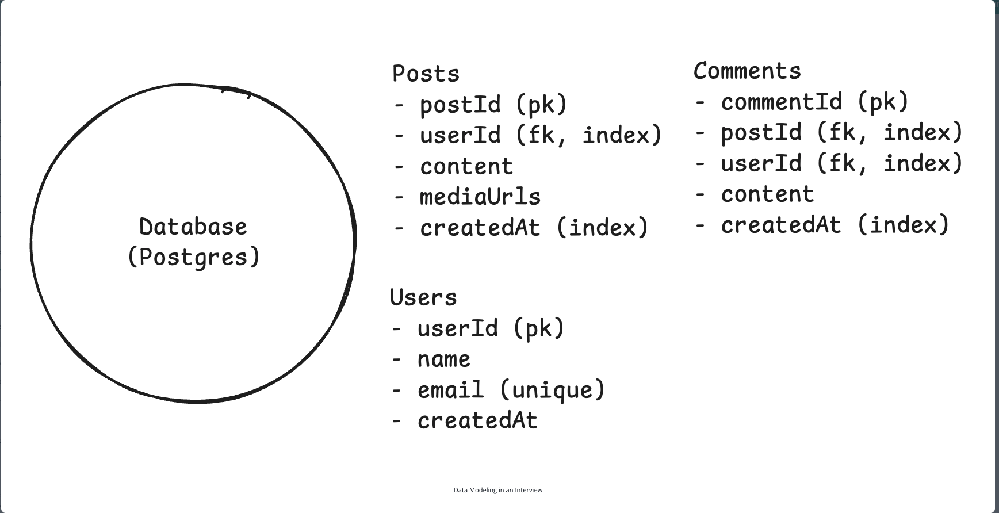
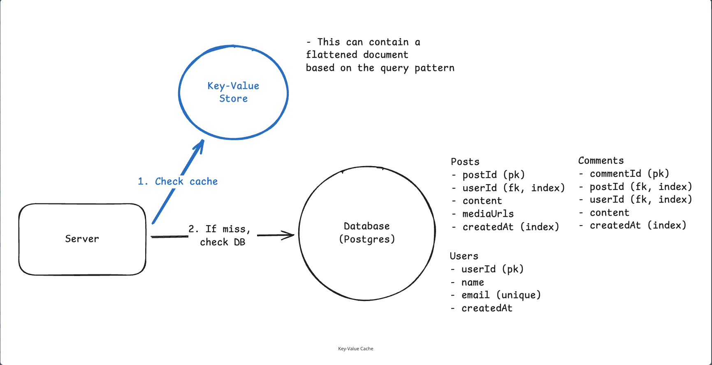
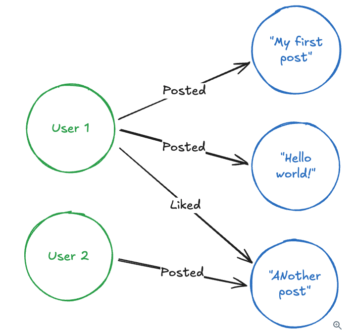
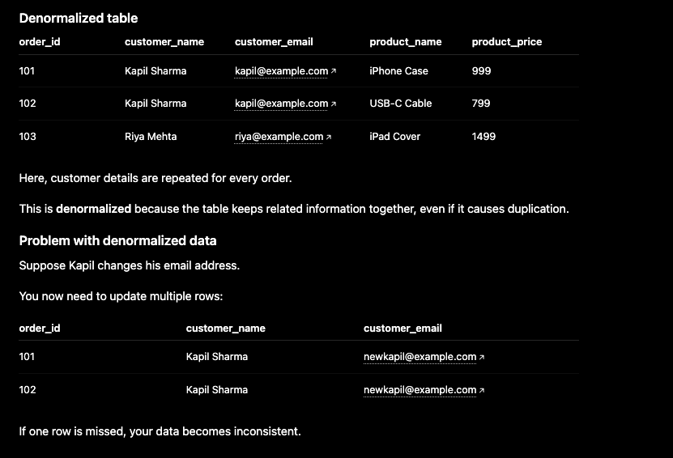
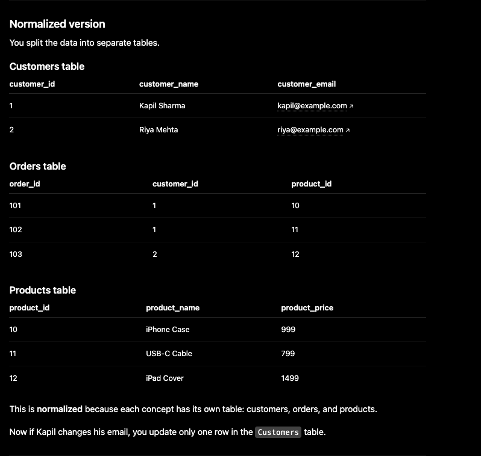

## Data Modeling

Related: [SQL vs NoSQL](08-SQL-vs-NoSQL.md)

- A data model describes how your data is structured, stored, and related.
- In practice, it means defining the entities and tables in your data, how you will find them, and how they relate to one another.



- In the delivery framework, it comes up twice.
  - First, during requirements gathering, you'll identify your core entities.
  - Later, in the high-level design step, you will sketch a basic schema alongside your database component. Include the key fields, relationships, and a note on how you'd index or partition to support the main query patterns.



### Database Model Options

- **Relational databases**: PostgreSQL, MySQL, SQLite
  - Almost always the answer in a system design interview.
  - Great at handling complex queries and relationships.
  - Multi-table joins can become performance traps.
  - The usual knock on relational databases is scalability, but that is often exaggerated. Modern SQL databases scale with techniques like **read replicas**, **sharding**, **connection pooling**, and **caching**.

- **Document databases**: MongoDB
  - Often used because of **schema flexibility**.
  - Stores data as JSON-like documents with flexible schemas, making them good for rapidly evolving applications where you don't know all your fields up front.
  - Your data modeling becomes more about nesting and embedding related information within documents rather than normalizing across tables.
  - **Consider over SQL** when your schema changes frequently.

- **Key-value stores**: Redis
  - Provide simple lookups where you fetch values by exact key match.
  - **Consider over SQL** when you need to look up data by a single identifier, such as for caching or session storage. However, "over SQL" is misleading here; in practice, you often use both together.

  

- **Graph databases**: Neo4j, Amazon Neptune
  - Store data as nodes and edges, optimizing for traversing relationships between entities.
  - **When to consider over SQL**: almost never in interviews.

  

### Schema Design Fundamentals

#### Entities, Keys, and Relationships

- Once you have identified your core entities, the next step is to map them into tables (or collections) with clear identifiers and relationships.
- For a social media app, you might have `users`, `posts`, `comments`, and `likes`. Each entity needs a **primary key** to uniquely identify records.
- Use system-generated IDs like `user_id` or `post_id` instead of business data like email addresses.

```text
users: id (PK), username, email
posts: id (PK), user_id (FK -> users.id), content, created_at
comments: id (PK), user_id (FK -> users.id), post_id (FK -> posts.id), content
likes: user_id (FK -> users.id), post_id (FK -> posts.id)
```

- Because `user_id` is a foreign key in `posts`, a user can have multiple posts. Similarly, because `post_id` is a foreign key in the `comments` table, a post can have multiple comments.
- This shows the core relationships: each post belongs to one user (`posts.user_id`), each comment belongs to one post and one user, and likes connect users to posts.

- With entities defined, connect them with relationships:
  - One-to-many (1:N): a user has many posts, and a post has many comments.
  - Many-to-many (M:N): users like many posts, and posts are liked by many users.
  - One-to-one (1:1): this is very rare in practice and often a sign that two tables should just be merged.

- These relationships are enforced through foreign keys in SQL or by application logic in NoSQL. Foreign keys help ensure referential integrity, meaning they prevent orphaned records like a post referencing a user that does not exist or comments pointing to deleted posts.
  - However, they come at a cost because the database has to validate each insert or update.
  - At a very large scale, some companies drop them for write performance and enforce integrity at the application level.

- Finally, layer in constraints like `NOT NULL`, `UNIQUE`, or `CHECK`. These enforce correctness at the database level, such as emails being unique or prices being positive, though they also add write overhead.

### Indexing for Access Patterns

- Indexes are the data structures that help the database find records quickly without scanning every row.
- Your indexes should directly support your most important queries. For a social media app:
  - Index on `posts.user_id` to quickly find all posts by a user.
  - Index on `posts.created_at` to load recent posts chronologically.
  - Composite index on `(user_id, created_at)` to efficiently load a user's recent posts.
  - Common index types include B-trees, hash indexes, etc.

- In interviews, connect your indexes directly to the API endpoints. "`GET /users/{id}/posts` needs an index on `posts.user_id`" shows you're thinking about real query performance.

### Normalization and Denormalization

- **Normalized data** means data is split into multiple related tables to reduce duplication.
- **Denormalized data** means data is intentionally duplicated or combined into fewer tables to make reads simpler or faster.



- A normalized version would split the data into multiple tables.



**Rule of thumb:** Normalized data avoids repetition, and denormalized data avoids too many joins.

### Scaling and Sharding

- Sharding means splitting one large dataset into smaller parts called **shards**.
- Each shard stores only a subset of the data.
- Example: a `users` table with 100 million users.
  - Instead of one database with 100 million users, split it across shards:
    - Shard 1: users 1 to 25 million
    - Shard 2: users 25 million to 50 million
    - Shard 3: users 50 million to 75 million
    - Shard 4: users 75 million to 100 million

- Each shard is usually a separate database or server.
- Common sharding strategies include **range-based sharding** and **hash-based sharding**. Sharding is covered in more detail in another core concepts file.

### Conclusion

- Data modeling is an important part of system design interviews, but it is usually not the main focus.
- Your **goal** is to show that you can design a reasonable schema that supports your system's functional requirements, then move on.

#### Interview Checklist

1. Determine which database you will use.
2. List the columns needed to fulfill the functional requirements for each entity.
3. Specify primary and foreign keys for each relationship.
4. Determine which columns need indexing, if any.
5. Consider whether sharding is necessary. If yes, choose a shard key that matches your main access pattern.
