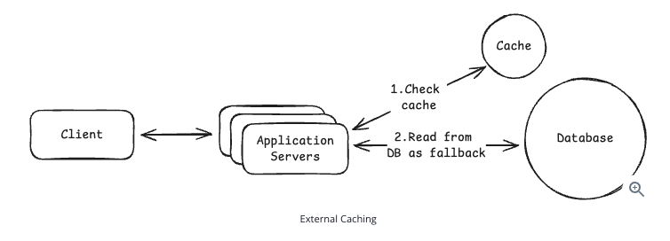
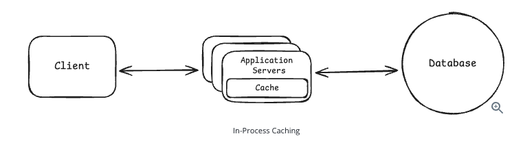

## Caching

- In system design interviews, caching comes up almost every time you need to handle high read traffic.
- Reading a user profile from PostgreSQL may take 50 ms, while reading it from an in-memory cache like **Redis** may take only 1 ms. That is around a 50x improvement in latency.
- Caches are essential for scalable systems because they reduce database load and cut latency dramatically. **However, they also create new challenges around invalidation and failure handling.**
- Caching sounds simple, but in interviews, the real discussion is about trade-offs such as latency, consistency, invalidation, freshness, cost, scalability, and failure modes.

> **Definition:** A cache is a temporary storage layer that keeps frequently accessed or expensive-to-compute data so that future requests can be served faster.

- Some **trade-offs** of caching are stale data (the cache may not reflect the latest data in the database), invalidation complexity (it can be hard to know when to remove or update cached data), extra infrastructure (Redis, Memcached, CDNs, local caches, etc.), consistency issues (different users or services may see different data), and failure modes (a cache outage can overload the database).

### Where to Cache?

- When most engineers hear about caching, they immediately think of **Redis** and **Memcached**, external cache stores that sit between the application and the database. This is the most common type of cache and the one interviewers care about most.
- However, caching appears at multiple layers of a system. Browsers, CDNs, applications, and even databases have caching capabilities.

#### 1. External Caching

- An external cache is a standalone caching service that your application communicates with over the network. This is what most people think of when they hear about caching. You store frequently accessed data in something like **Redis** or **Memcached** so that you do not have to query the database every time.
- External caches scale well because every application server can share the same cache. They also support eviction policies such as LRU and TTL-based expiration.

> 💡 **Interview Tip**
>
> In system design interviews, external caching with Redis is the default answer when discussing caching strategies. Interviewers expect you to mention it for any high-traffic system. Start here, then layer on other caching types such as CDN or client-side caching only if the problem calls for them.

#### 2. CDN (Content Delivery Network)

- A CDN caches content at edge locations close to users. Well-known CDN providers include Cloudflare, Akamai, AWS CloudFront, and Google Cloud CDN.
- CDNs are useful for serving images, videos, CSS and JavaScript files, public API responses, news article pages, and other cacheable content.

*CDNs are also covered in the Key Technologies section.*

#### 3. Client-Side Caching

- Data is cached on the user's device or in the browser.
- Examples: static images, CSS and JavaScript files, profile data, and feature flags.
- Common mechanisms: browser local storage, mobile app caches, IndexedDB, etc.
- Best suited for: static assets, rarely changing data, offline-friendly applications, and reducing network calls.

#### 4. In-Memory Caching

- It is easy to overlook that application servers often have plenty of memory available.
- The idea is simple: if your application repeatedly requests the same small pieces of data, store them in a local cache within the process. Reads from local memory are even faster than reads from Redis because they avoid network calls.

