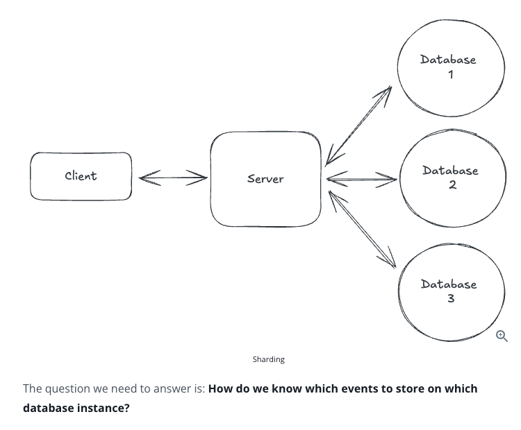
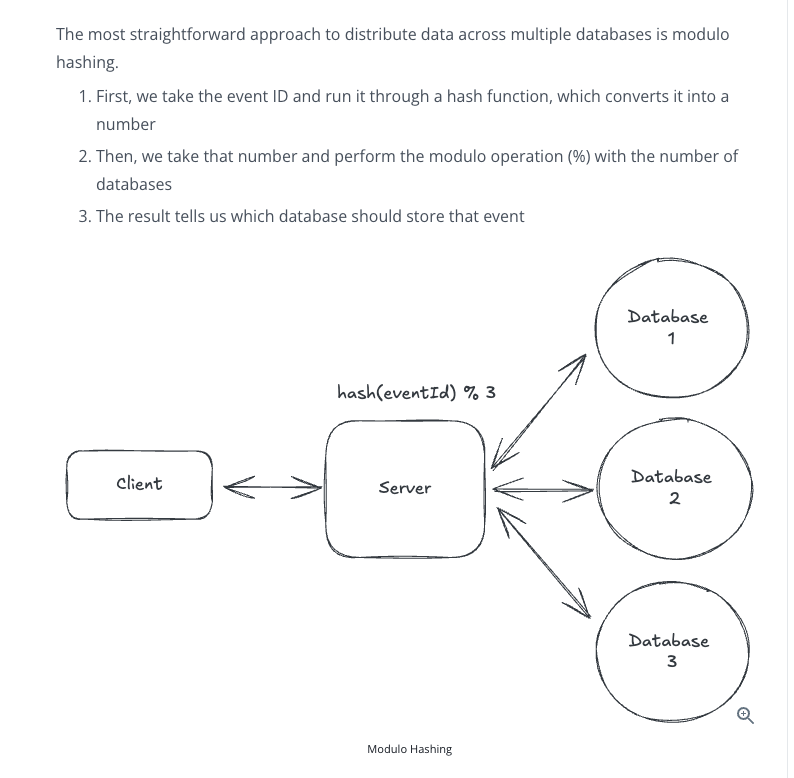
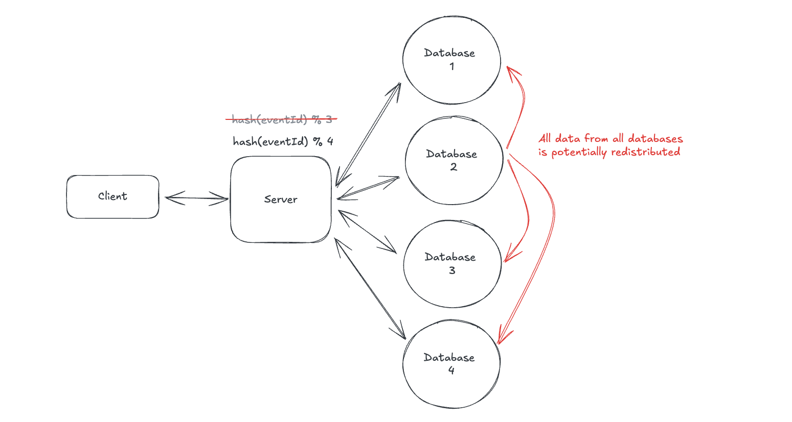
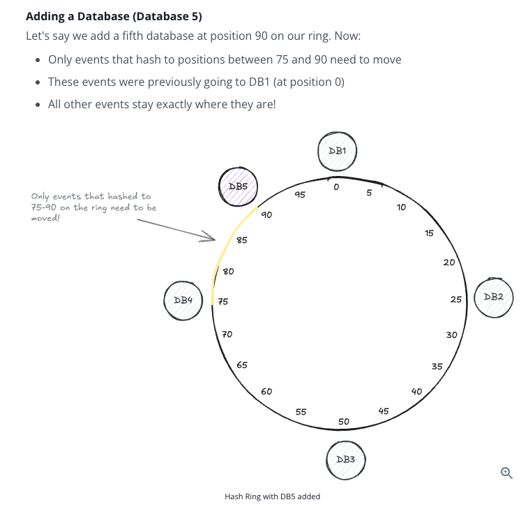
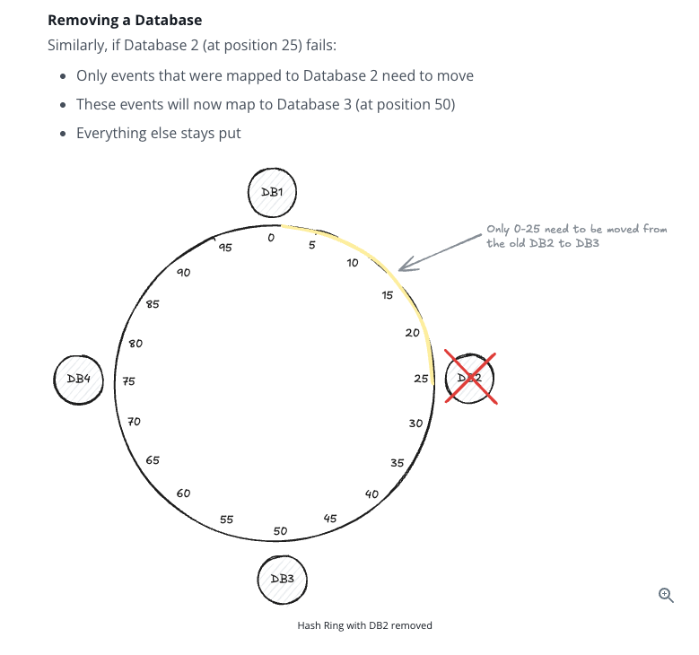
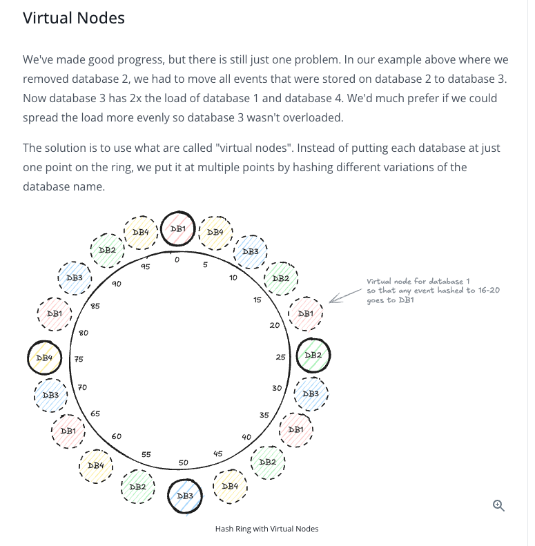

## Consistent Hashing

- Consistent hashing is a technique used to distribute keys across multiple servers or nodes such that when a node is added or removed, only a small fraction of keys need to move.

### The Core Problem It Solves

- In distributed systems, we often need to decide: Which server should store or serve this key?
- Examples:
  - `user_123` -> which cache server?
  - `video_456` -> which storage node?
  - `session_789` -> which shard?

- A naive approach is: `server = hash(key) % number_of_servers`.
- This works badly when servers are added or removed.
- For example: suppose you have 4 servers:
  - `hash(user_123) % 4` -> server 2. Now, one more server has been added.
  - `hash(user_123) % 5` -> server 4.
  - The same key may now go to a completely different server.
  - In fact, when `N` changes, most of the keys get remapped. This causes:
    - Cache misses
    - Data movement
    - Load spikes
    - Rebalancing pain
  - So, this is the main motivation for consistent hashing.

### Let's Build Intuition With Another Example

- Suppose you're designing a ticketing system like Ticketmaster. Initially, your system is simple:
  - One database stores all the event data.
  - The client makes a request to fetch the information, and you return it.
  - Everything works smoothly at first.
- But success brings challenges. As your platform grows popular and hosts more events, a single database can no longer handle the load. You need to distribute your data across multiple databases, a process called **sharding** (which we have already discussed in [Sharding](04-sharding.md)).

**How do we know which events to store on which database instance?**

#### First Attempt: Simple Modulo Hashing

This is the same approach that we discussed above.

- The problem with modulo hashing is that if we add a new server, it will change the database instance on which almost every event was stored. Refer to the image below.

- **This causes huge database load, meaning the users are either unable to access data or they experience slow response time.**
- This would happen again if we reduced the number of servers. Therefore, **we need to introduce consistent hashing**.

### Consistent Hashing

- Consistent hashing is a technique for solving the problem of data redistribution when adding or removing an instance in a distributed system (adding or removing database instances).

> **Important:** The key insight is to arrange both our data and our databases in a circular space, often called a **hash ring**.

Here's how it works:

1. We first create a hash ring with a fixed number of points. To keep it simple, let's say 100.
2. We then place our database nodes on the hash ring. In the case where we have 4 databases, we could put them at points 0, 25, 50, and 75.
3. In order to know which database an event should be stored on, we first hash the event ID like we did before, but instead of using modulo, we just find the hash value on the ring and then move clockwise until we find a database instance.

> **Important:** In reality, a hash ring usually has a hash space of `0` to `2^32 - 1`, not `0-100`, but the concept is the same.

#### How Does This Solve Our Problem?

Consider these screenshots from hellointerview.com.

- Adding a database

- Removing a database

#### Concept of Virtual Nodes

### Conclusion

- Consistent hashing is one of those algorithms that revolutionized distributed systems by solving a seemingly simple problem: how to distribute data across servers while minimizing redistribution when the number of servers changes.

- While the implementation details can get complex, the core concept is beautifully simple: arrange everything in a circle and walk clockwise. This elegant solution is now built into many of the distributed systems we use daily, from DynamoDB to Cassandra.

- In your next system design interview, remember: you usually don't need to implement consistent hashing yourself. Just know when it's being used under the hood, and save the deep dive for those infrastructure-heavy questions where it really matters.
