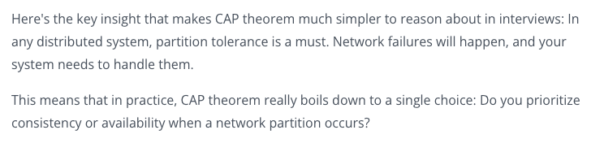
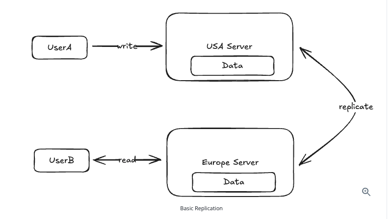

## CAP Theorem

- It is foundational to how you approach your design in an interview.
- We will learn what it is, how it works, and the practical trade-offs we need to make when considering the CAP theorem during the **non-functional requirements** phase of a system design interview.

> **Important:** Consider the CAP theorem during the **non-functional requirements** phase of the interview.

### What Is the CAP Theorem?

- At its core, it says that, in a distributed system, you can only have 2 out of 3 of the following properties:
  - **Consistency:** Consistency means all nodes see the same latest data. When a write is made to one node, all subsequent reads from any node will return that updated value.
    - Consistency means all nodes see the same latest data.
  - **Availability:** Every request will get a response even if some nodes are down or disconnected.
    - Availability means the system keeps serving requests.
  - **Partition Tolerance:** Some nodes cannot communicate with other nodes due to a network failure.
    - For example, database node A cannot talk to database node B. Both machines may be running, but the network between them is broken.
    - This is common in distributed systems. **Partition tolerance** means the system continues to operate despite network communication failures.

> **Most important:** You do not really get to choose P (partition tolerance); the choice is only between C (consistency) and A (availability).

- So basically, in a distributed system, when a network partition happens, you must choose between consistency and availability (C or A).

### Understanding the CAP Theorem Through an Example

- Imagine you're running a website with two servers: one in the USA and one in Europe. When a user updates their public profile (let's say their display name), here's what happens:

1. User A connects to their closest server (USA) and updates their name.
2. This update is replicated to the server in Europe.
3. When User B in Europe views User A's profile, they see the updated name.

Everything works smoothly until we encounter a network partition: the connection between our USA and Europe servers goes down. Now we have a critical decision to make.

When User B tries to view User A's profile, should we:

- **Option A:** Return an error because we can't guarantee the data is up-to-date (choosing consistency).
- **Option B:** Show potentially stale data (choosing availability).

- This is where the CAP theorem becomes practical: we must choose between consistency and availability.
- In this case, the answer is rather clear: we would rather show a user in Europe the old name of User A than show an error. Seeing a stale name is better than seeing no name at all.

### When to Choose Consistency

- Some systems require consistency, even at the cost of availability:
  1. **Ticket Booking Systems:** Imagine if User A booked seat 6A on a flight, but due to a network partition, User B sees the seat as available and books it too. You'd have two people showing up for the same seat!
  2. **E-commerce Inventory:** If Amazon has one toothbrush left and the system shows it as available to multiple users during a network partition, they could oversell their inventory.
  3. **Financial Systems:** Stock trading platforms need to show accurate, up-to-date order books. Showing stale data could lead to trades at incorrect prices.

### When to Choose Availability

- The majority of systems can tolerate inconsistency and should prioritize availability. In these cases, eventual consistency is fine. This means the system will eventually become consistent, but it may take a few seconds or minutes.
  1. **Social Media:** If User A updates their profile picture, it's perfectly fine if User B sees the old picture for a few minutes.
  2. **Content Platforms (like Netflix):** If someone updates a movie description, showing the old description temporarily to some users isn't catastrophic.

### Advanced CAP Theorem Considerations

- As systems grow in complexity, the choice between consistency and availability isn't always binary. Modern distributed systems often require nuanced approaches that vary by feature and use case. Let's explore these advanced considerations.
- **Real-world systems frequently need both availability and consistency, just for different features.** Let's look at two examples.

#### Example 1: Ticketmaster

- Ticketmaster needs different consistency models for different features within the same system:
  - **Booking a seat at an event:** Requires strong consistency to prevent double-booking, as we discussed in the previous section.
  - **Viewing event details:** Can prioritize availability (showing slightly outdated event descriptions is acceptable).
  - **In an interview, you might say:** "For this ticketing system, I'll prioritize consistency for booking transactions but optimize for availability when users are browsing and viewing events."

#### Example 2: Tinder

- Similarly, Tinder has mixed requirements:
  - **Matching: Needs consistency.** If both users swipe right at about the same time, they should both see the match immediately.
  - **Viewing a user's profile:** Can prioritize availability. Seeing a slightly outdated profile picture is acceptable if a user just updated their image.
  - **In an interview, you might say:** "For this dating app, I'll prioritize consistency for matching but optimize for availability when users are viewing profiles."
