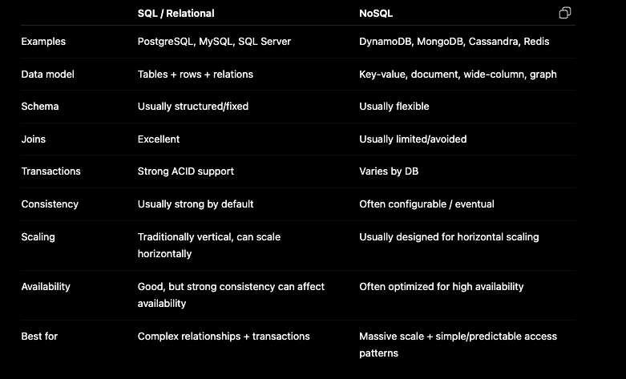

## SQL vs NoSQL
- SQL databases are relational, table based and use a fixed schema.
- NoSQL databases are non-relational, document or key-value-based, and feature a dynamic schema.

- For a system design interview, we just need to understand the trade-offs: data models, consistency, transactions, scalability, availability, querying patterns, and concurrency.

### Main Difference
