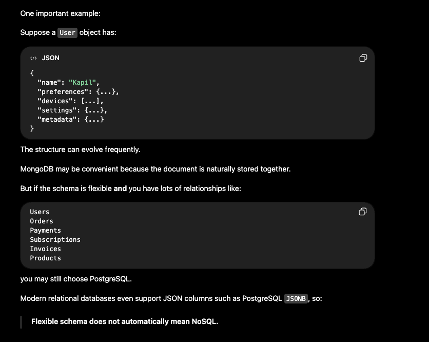

## SQL vs. NoSQL

- SQL databases are relational and table-based, and they use a fixed schema.
- NoSQL databases are non-relational, document-based or key-value-based, and typically use a flexible schema.

For a system design interview, we need to understand the trade-offs involving data models, consistency, transactions, scalability, availability, query patterns, and concurrency.

### Main Difference


### When Should We Use SQL?

Use SQL when the data has strong relationships, such as:

```text
Users -> Orders -> Order Items -> Products
```

SQL is also a natural choice when queries frequently require joins:

```sql
SELECT ...
FROM orders
JOIN users ON ...
JOIN products ON ...;
```

Another reason to use SQL is when the system requires strong transactional guarantees. Consider a transfer of ₹1,000 from Account A to Account B:

```text
Account A: -₹1,000
Account B: +₹1,000
```

Both operations must happen, or neither should happen:

```sql
BEGIN;

UPDATE accounts
SET balance = balance - 1000
WHERE account_id = 'A';

UPDATE accounts
SET balance = balance + 1000
WHERE account_id = 'B';

COMMIT;
```

If either operation fails, the transaction is rolled back. This behavior is supported by ACID guarantees.

> [!NOTE]
> ### ACID Properties
>
> **ACID** stands for **Atomicity, Consistency, Isolation, and Durability**. These four properties make database transactions reliable and safe, especially when multiple operations or users are involved.
>
> A transaction is a group of database operations treated as one logical unit. For example, transferring ₹1,000 from Account A to Account B involves deducting ₹1,000 from Account A and depositing ₹1,000 into Account B. ACID helps ensure that this transaction happens correctly.
>
> #### 1. Atomicity
>
> - Either every operation in a transaction succeeds, or none of the operations are applied.
> - **All or nothing.**
>
> 
>
> #### 2. Consistency
>
> A transaction must move the database from one valid state to another while respecting all constraints and business rules.
>
> Suppose the following rule applies:
>
> ```text
> balance >= 0
> ```
>
> If Account A has ₹500 and someone tries to transfer ₹1,000, the operation should fail when overdrafts are not allowed.
>
> Other consistency rules include:
>
> - `PRIMARY KEY`
> - `FOREIGN KEY`
> - `UNIQUE`
> - `NOT NULL`
> - `CHECK` constraints
>
> For example:
>
> ```sql
> age INTEGER CHECK (age >= 18)
> ```
>
> The database should reject a value such as `age = 15` because it violates the constraint.
>
> **Consistency ensures that all database constraints and integrity rules remain satisfied before and after a transaction.**
>
> #### 3. Isolation
>
> Many transactions may run at the same time, but they should behave as though they were executing in isolation from one another.
>
> Imagine that an account has a balance of ₹10,000 and two transactions simultaneously attempt to withdraw ₹7,000:
>
> 1. Transaction 1 reads the ₹10,000 balance.
> 2. Transaction 2 also reads the ₹10,000 balance.
> 3. Transaction 1 withdraws ₹7,000.
> 4. Transaction 2 also withdraws ₹7,000.
>
> Without proper isolation, both transactions may incorrectly conclude that enough money is available.
>
> Isolation helps prevent concurrency problems such as:
>
> - **Dirty read:** Reading uncommitted data.
> - **Non-repeatable read:** Reading the same row twice but receiving different values.
> - **Lost update:** One transaction overwrites another transaction's update.
>
> ##### Locks and Isolation
>
> One common mechanism databases use to provide isolation is locking. Locks can be acquired on rows, tables, or pages (groups of rows).
>
> The two basic lock types are:
>
> - **Shared lock (S):** Used when a transaction reads data; multiple readers can usually coexist.
> - **Exclusive lock (X):** Used when a transaction modifies data; other conflicting reads or writes may have to wait.
>
> #### 4. Durability
>
> Durability means that once a transaction is committed, it remains committed. The committed data survives failures such as an application crash or a database restart.

#### How Does SQL Scale?

- **Vertical scaling:** Initially, increase CPU, RAM, or SSD capacity. This approach is simple and effective.
- **Read replicas:** Useful for read-heavy applications. Writes go to the primary database, while reads go to replicas.
  - Replication can lag. A write to the primary followed immediately by a read from a replica may return stale data.
  - For critical reads that require the latest data, read from the primary database.

### When Should We Use NoSQL?

NoSQL becomes attractive when a system requires massive horizontal scalability. For example, suppose the system has:

- 500 million users
- 10 billion events per day

Its primary operation might be:

```text
Get data by user_id
```

A distributed key-value or document database can shard this data naturally:

```text
hash(user_id) -> Shard 1, Shard 2, Shard 3, Shard 4, ...
```

Good NoSQL use cases include:

- User sessions
- Logs
- Caching
- Chat messages
- IoT events

### Polyglot Persistence

Polyglot persistence means using multiple database technologies within a single application or system.


#### Choose SQL When

- The data has strong relationships
- The system requires transactions
- The database must enforce constraints
- Queries are complex
- Strong consistency is required

#### Choose NoSQL When

- The schema needs to be flexible
- The data needs to be partitioned easily
- The system requires high write throughput
- Query patterns are simple and predictable

### Partition and Sort Keys in NoSQL Databases

- **Partition key:** Determines where data is stored in a distributed database.
  - Example: `user_id = 123`
  - The database may internally calculate `hash(user_id)` to select a partition or node.
  - Example distribution:

    ```text
    user_123 -> Partition A
    user_456 -> Partition B
    user_789 -> Partition C
    ```

  - A partition key should have high cardinality, meaning it has many distinct values relative to the total number of records. For example, `country` usually has low cardinality, while `user_id` usually has high cardinality.
  - A good partition key distributes traffic evenly and avoids hot partitions.

- **Sort key:** Organizes multiple records within the same partition.
  - For example, the partition key could be `user_id`, while the sort key could be `created_at`.

> [!IMPORTANT]
> When transactions are required—especially across multiple rows or tables—SQL is often the natural fit.
>
> For example, placing an order may involve:
>
> - Creating the order
> - Deducting inventory
> - Recording the charge or payment
> - Updating the customer's balance
> - Creating an invoice
>
> These operations are strongly related and must behave atomically. A relational database such as PostgreSQL or MySQL is often the simpler choice.

### Choosing Between SQL and NoSQL

It is often difficult to decide when to choose SQL and when to choose NoSQL.

Choose SQL when the data has strong relationships, queries require complex joins, transactions require strong guarantees, or constraints and data integrity are important. `PRIMARY KEY` and `FOREIGN KEY` constraints enforce entity and referential integrity, while `CHECK` constraints enforce user-defined rules on rows.

Choose NoSQL when the system requires extensive horizontal scaling, the data has fewer relationships, or the document structure needs to be flexible and evolve over time. Common examples include user sessions, caching, IoT events, logs, and activity feeds.


