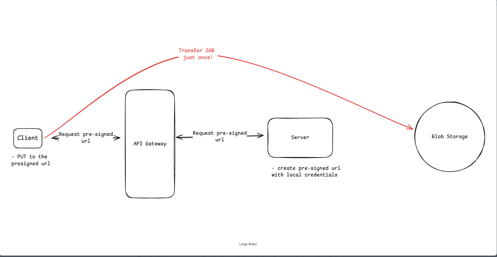

## Common Patterns
#### Recognize -> apply -> explain tradeoff

- Just remember, **patterns are often combined, not used independently, and recognizing them helps you avoid reinventing the wheel during interviews.**

#### The main patterns to know:

| Pattern                    | When you should recognize it           | Common examples                                     |
| -------------------------- | -------------------------------------- | --------------------------------------------------- |
| **Real-time updates**      | “Users should see updates instantly”   | Chat, notifications, live comments, live dashboards |
| **Long-running tasks**     | “This operation takes seconds/minutes” | Video encoding, report generation, file processing  |
| **Contention handling**    | “Many users compete for same resource” | Last ticket, inventory, auction bidding             |
| **Scaling reads**          | “Too many users are reading data”      | Feeds, product pages, profiles, posts               |
| **Scaling writes**         | “Too many writes are hitting one DB”   | Logs, metrics, likes, chat messages                 |
| **Large blob handling**    | “Users upload/download large files”    | Videos, images, PDFs, backups                       |
| **Multi-step processes**   | “Business flow has many steps”         | Checkout, payment, order fulfillment, onboarding    |
| **Proximity-based search** | “Find nearby things”                   | Uber drivers, nearby restaurants, delivery partners |

##### 1. Real-time Updates
- Use this when the interviewer says:
    - chat messages should appear instantly
    - live comments
    - driver location should update
    - notification should appear immediately

- Basic options: Polling -> SSE -> WebSockets
- **Start simple with polling. Use WebSockets/SSE when low-latency updates are truly required.**

###### Polling vs SSE vs WebSockets

Core difference: **polling means the client keeps asking**, **SSE means the server pushes updates to the client**, and **WebSockets means both client and server can send messages anytime**.

| Approach | How it works | Best for | Main tradeoff |
| -------- | ------------ | -------- | ------------- |
| **Polling** | Client repeatedly asks the server for updates every few seconds. | Simple updates, low-scale systems, cases where slight delay is acceptable. | Easy to build, but can waste requests when nothing changed. |
| **SSE** | Client opens one long-lived HTTP connection, and the server pushes updates to the client. | One-way real-time updates like notifications, live feeds, progress updates, dashboards. | Simpler than WebSockets, but only server-to-client. |
| **WebSockets** | Client and server keep a persistent two-way connection open. | Chat, multiplayer games, collaborative editing, live bidirectional communication. | Powerful, but more operationally complex. |

###### Polling

- The client sends a request like "Any new updates?" every fixed interval, for example every 5 seconds.
- This is the simplest option because it uses normal HTTP requests.
- It works well when updates are not very frequent or real-time accuracy is not strict.
- The downside is wasted work: if there are no updates, the server still receives repeated requests.
- Polling also adds delay because the user only sees the update on the next poll.

###### SSE

- SSE stands for Server-Sent Events.
- The client makes one HTTP request and keeps the connection open.
- Whenever the server has new data, it sends an event on that same connection.
- It is a good fit when updates only need to flow from server to client.
- Compared to polling, SSE avoids repeated empty requests and usually feels more real time.
- Compared to WebSockets, SSE is simpler because it still works over HTTP and is only one-way.

> 💡 **Interview insight**
>
> In interviews, quickly recognize the pattern from the requirement, apply the simplest correct architecture, then discuss tradeoffs. For real-time updates, use polling for simple low-scale cases, SSE for one-way updates, and WebSockets for bidirectional real-time communication.

#### 2. Long-Running Tasks
- Use this when something cannot finish inside a normal API request.
- For example:
    - User uploads video -> video needs transcoding
- Bad design:
    - `POST /upload` waits 5 minutes until transcoding completes

- Better design:
    - API server stores request
    - Pushes jobs to a queue
    - Returns `job_id` immediately
    - Worker picks up the job
    - User checks status later

- Simple architecture:
    - Client -> API Server -> Queue -> Worker -> DB

> 💡 **Interview insight**
>
> If the task takes more than a few seconds, use async processing with a queue and worker pool.

- Examples: video transcoding, PDF generation, bulk email sending, data export, ML processing, etc.

#### 3. Contention Handling
- Use this when multiple users modify the same resource.
- Example:
    - Only 1 concert ticket left.
    - 100 users click “Buy” at the same time.

- Problem: Without protection, you may sell the same ticket twice.
- Common solutions:
    - Database transactions
    - Row-level lock
    - Distributed lock
    - Queue-based serialization

##### If correctness matters, serialize access to the shared resource.
- Example answer:
    - For ticket booking, I would use a DB transaction or lock around seat reservation. Only one request can successfully reserve the seat.

- This is especially useful for Ticketmaster, inventory checkout, auctions, wallet balance, seat booking, etc.
- Start with database-level approaches before jumping into more complex distributed coordination.

#### 4. Scaling Reads
- Use this when reads are much higher than writes.
- Example:
    - One celebrity posts a photo
    - Millions of users read it
    - Only one write, millions of reads
- Common techniques:
    - Cache
    - CDN
    - Read Replicas
    - Indexes
    - Precomputation

##### For read-heavy systems, reduce database hits using cache, replicas, indexes, and precomputed views.
- Example: Design Instagram Feed
- Better answer:
    - Store posts in DB
    - Cache hot feeds in Redis
    - Use CDN for images/videos
    - Use read replicas for read-heavy queries

- Important tradeoffs:
    - Cache improves speed but introduces invalidation problems
    - Read replication improves read scale but can have replication lag

- **Interview line: I would scale reads gradually: first indexes, then read replicas, then caching/CDN for hot data.**
- Read traffic often grows faster than write traffic, and common tools include indexing, denormalization, read replicas, Redis, and CDNs.

#### 5. Scaling Writes

- Use this when one database cannot handle write volume.
- Example:
    - Millions of chat messages
    - High volume metrics
    - User activity logs
    - Like events
    - Payment events

- Common techniques:
    - Sharding
    - Batching
    - Queues
    - Partitioning

##### Distribute writes using partitioning/sharding and absorb bursts using queues.

- Example: Design logging system
- Bad design: Every log write directly hits one database
- Better design: App servers -> Kafka -> consumers -> partitioned storage

- **Choosing a good partition key is critical**
- Good partition key: `user_id`, `conversation_id`, `merchant_id`, `device_id`
- Bad partition key: `country`, `status`, `created_date` only
    - Bad keys can create hot partitions

- **Interview line: To scale writes, I would shard by a high-cardinality key and use queues/batching to smooth write spikes.**
- Sharding, batching, queues, load shedding, and careful partition-key selection as core write-scaling ideas.

#### Partitioning vs Sharding

| Concept | What it means | Where data lives | Interview use case | Main tradeoff |
| ------- | ------------- | ---------------- | ------------------ | ------------- |
| **Partitioning** | Splitting a large dataset into smaller pieces. | Can be inside the same database/server or across multiple servers. | Improve query performance, retention, manageability, or write organization. | You must choose a good partition key and avoid hot partitions. |
| **Sharding** | Horizontal partitioning across multiple machines/databases. | Data is spread across different database nodes. | Scale writes, storage, and traffic beyond what one database can handle. | Cross-shard queries, joins, transactions, and resharding become harder. |

##### Key interview differences

- **Partitioning is the general idea; sharding is a specific type of partitioning.**
- Partitioning may happen within one database, while sharding usually means data is split across multiple database servers.
- Partitioning is often used for performance and data management, for example partitioning logs by date.
- Sharding is used when one machine or database cannot handle the write volume, storage size, or traffic.
- For partitioning, talk about partition pruning, retention, and hot partitions.
- For sharding, talk about shard key choice, uneven load, cross-shard queries, distributed transactions, and resharding.

> 💡 **Interview insight**
>
> All sharding is partitioning, but not all partitioning is sharding. In system design interviews, say partitioning helps organize and query large data, while sharding spreads data across machines to scale storage and writes.

#### 6. Handling Large Blobs
- Use this when users upload or download large files.
- Large files like videos, images, and documents need special handling in distributed systems.
- **Instead of routing gigabytes through application servers, use direct client-to-storage transfers with presigned URLs and CDN delivery.**

- **Bad design:** The client uploads a 2 GB file through the application server, making the server a bottleneck.
- **Better design:**
    - Client asks API for presigned URL
    - Client uploads directly to S3/blob storage
    - Metadata is stored in DB
    - CDN serves downloads

- The application server generates a temporary, scoped presigned URL that lets the client upload directly to object storage like S3.
- Downloads are served through a CDN, optionally using signed URLs for access control.

- Key challenges:
    - Synchronizing database metadata with blob storage
    - Handling failed or incomplete uploads
    - Managing the lifecycle of large files
    - Processing storage event notifications to keep application state consistent

- **Example: Design YouTube Upload**
    - Client <--> API: request upload URL
    - API -> Client: return presigned URL
    - Client <--> S3: uploads video directly
    - S3 event -> queue -> worker transcodes video
    - Metadata -> DB
    - Video served via CDN

- Application servers should only handle metadata and authorization, not stream huge files themselves.

> 💡 **Interview insight**
>
> Do not route large files through application servers. Upload directly to object storage using presigned URLs, store metadata in a database, and serve downloads through a CDN.

#### 7. Multi-Step Processes
- Use this when one business flow has multiple dependent steps.
- Each step may call a different service, and the complete process may take seconds, minutes, or even days.
- The system must remember the current step and safely handle failures and retries.

- Example: placing an e-commerce order
    - Place order
    - Reserve inventory
    - Process payment
    - Create shipment
    - Notify seller
    - Send confirmation to the customer

- Problems to handle:
    - What if payment succeeds but shipment creation fails?
    - What if notification fails?
    - What if a retry charges the customer twice?
    - How does the system continue after a service restarts?

- Common approaches:
    - Saga pattern
    - State machine
    - Workflow engine
    - Event-driven orchestration

- **Track the current state explicitly, and make every step retryable and idempotent.**

##### Example order states

`CREATED -> INVENTORY_RESERVED -> PAID -> SHIPPED -> COMPLETED`

Persist each state change so the process can resume from the last successful step after a failure.

##### Common examples

| Process | Typical steps |
| ------- | ------------- |
| **E-commerce checkout** | Create order -> reserve stock -> collect payment -> create shipment -> send confirmation |
| **Food delivery** | Place order -> restaurant accepts -> prepare food -> assign driver -> deliver order |
| **Travel booking** | Reserve flight -> reserve hotel -> collect payment -> issue confirmation |
| **User onboarding** | Create account -> verify email -> verify identity -> set up profile -> activate account |
| **Payment refund** | Request refund -> validate request -> reverse payment -> update order -> notify customer |
| **Loan application** | Submit application -> verify documents -> run credit check -> approve or reject -> disburse funds |
| **Subscription signup** | Create subscription -> collect payment -> enable access -> send receipt |

##### Choosing an approach

- Use a **state machine** when the steps and allowed transitions are clear.
- Use a **Saga** when multiple services update their own data and failed steps may need compensating actions, such as refunding a payment or releasing inventory.
- Use a **workflow engine** when the process is long-running, has many branches, or needs built-in retries, timers, and visibility.

> 💡 **Interview insight**
>
> I would model the process as a state machine, save every state transition, and make each step idempotent so retries are safe. If a completed step must be undone after a later failure, I would use a Saga with compensating actions.
