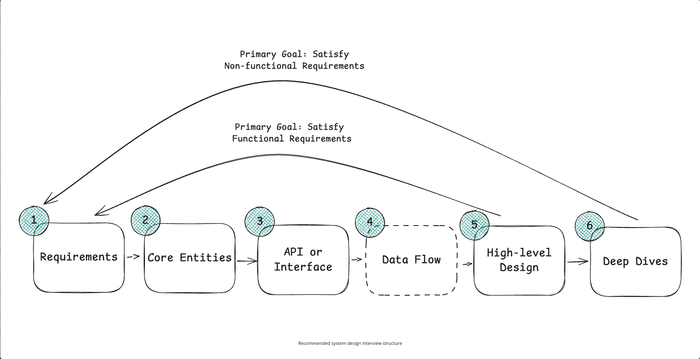
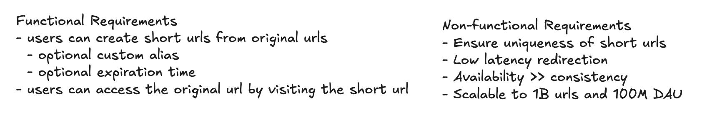
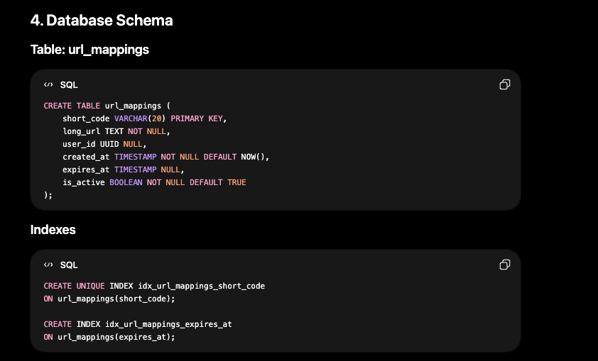
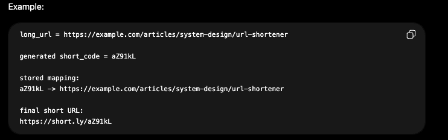

# Design URL Shortener

## Problem Statement

Design a URL shortener like Bitly.

A URL shortener allows users to submit a long URL and receive a shorter URL. When someone opens the short URL, the system redirects them to the original long URL.

Example:

```text
Long URL:
https://example.com/articles/system-design/url-shortener?id=12345

Short URL:
https://short.ly/abc123
```



### 1. Functional Requirements

- Users should be able to submit a long URL and receive a shortened version.
  - Optionally, users should be able to specify a custom alias for their shortened URL (i.e., "www.short.ly/my-custom-alias")
  - Optionally, users should be able to specify an expiration date for their shortened URL.
- Users should be able to access the original URL by using the shortened URL.

Out of scope:

- User authentication & account management
- Analytics on link clicks (e.g., click counts, geographic data)

### 2. Non-functional Requirements

- System should ensure uniqueness for the short codes (each short code maps to exactly one long URL)
- The redirection should occur with minimal delay (< 100 ms)
- The system should be highly available - 99.99% of the time (availability > consistency)
- The system should support 1B shortened URLs and 100M DAU



### 3. Core Entities

- Original URL: The long URL that user wants to shorten
- Short URL: The shortened URL that user receives and can share
- User: Represents a user who wants to create the short URL

### 4. API or Interface

- **Simply go one by one through the core requirements and define the APIs that are necessary to satisfy them. Usually, these map 1:1 to the functional requirements, but there are times when multiple endpoints are needed to satisfy an individual functional requirement.**

- To shorten a URL, we'll need a POST endpoint that takes in the long URL and optionally a custom alias and expiration date, and returns the shortened URL. We use POST here because we are creating a new entry in our database mapping the long URL to the newly created short URL.

```text
// Shorten a URL
POST /urls
{
  "long_url": "https://www.example.com/some/very/long/url",
  "custom_alias": "optional_custom_alias",
  "expiration_date": "optional_expiration_date"
}
->
{
  "short_url": "http://short.ly/abc123"
}
```

- For redirection, we'll need a GET endpoint that takes in the short code and redirects the user to the original long URL. GET is the right verb here because we are reading the existing long URL from our database based on the short code.

```text
// Redirect to Original URL
GET /{short_code}
-> HTTP 302 Redirect to the original long URL
```

- We can actually return 301 or 302 code from the URL, but 302 allows us to have more control because the browser does not permanently cache the URL. However, if we return 301, browser can cache the URL and then we won't have control if link expires, gets deleted or needs analytics tracking.

> Bonus: the database schema could look like this.

- We can have a table called `url_mappings` with columns like `short_code`, `long_url`, `is_active`, `user_id`, `created_at`, and `expires_at`.



### 5. High-Level Design

- **Go one by one through the functional requirements and design a single system to satisfy them.**

#### 1) Users should be able to submit a long URL and receive a short URL

- In a URL shortener, the main algorithmic question is: how do we generate a short code that is unique, small, and fast to create?
- We usually do not directly convert the long URL into a short URL. We first generate the short code, store it in a database, and map it to the long URL.



```text
long_url
   |
   v
generate unique short_code
   |
   v
store short_code -> long_url
   |
   v
return https://short.ly/{short_code}
```

#### 2) Users should be able to access the long URL (original URL) by using the shortened URL
