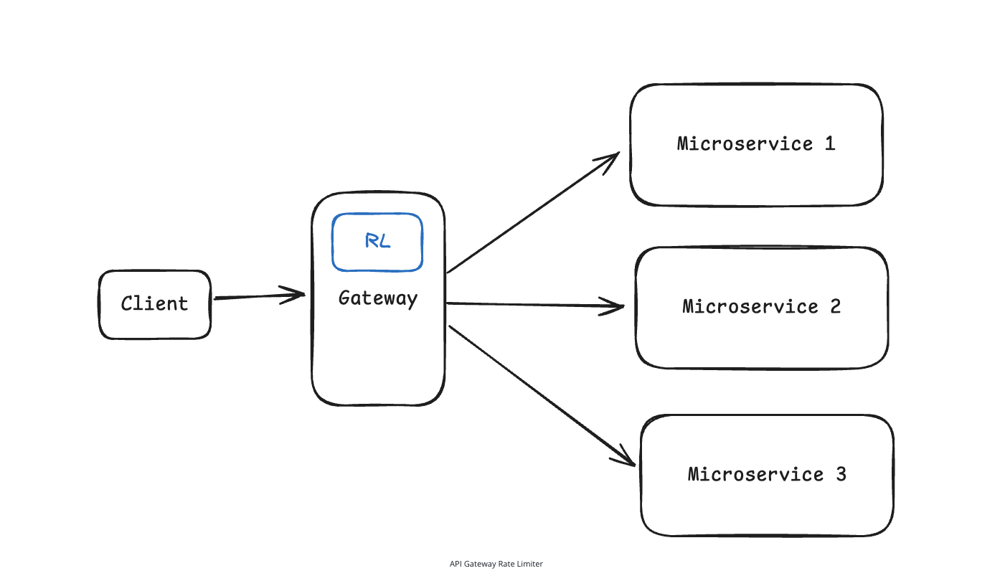

# Designing Rate Limiter

## What is rate limiter?

- A rate limiter controls how many requests a client can make within a specific time frame.
- It acts like a traffic controller for your API—allowing, for example, "100 requests per minute" from a user, then rejecting excess requests with an HTTP 429 "Too Many Requests" response.
- Prevents abuse, protects your servers from being overwhelmed by bursts of traffic, and ensure fair usage across all users.

> [!NOTE]
> Excellent problem—the main difficulty here is: where the limiter lives, which algorithm it uses, and how multiple servers update the same counter safely.

## We will follow the exact same framework from Hello Interview which is:

`Requirements -> Core Entities -> API or Interface -> Data Flow (it is not applicable for this scenario) -> High-Level Design -> Deep Dives`

### The most important topics going to be are:

- Rate Limiter Placement
- Client Identification (by API key, IP, `client_id`, etc.)
- Token-bucket Algorithm
- Redis Shared State
- Atomic Updates
- Redis Sharding
- Fail-open vs Fail-closed

## Simplest Mental Model

**Suppose the rule is:**

A user can make 100 requests per minute.

**For every incoming request, the rate limiter asks:**

- Who is making the request?
- Which rule applies?
- Has the client crossed the limit?
- Return the success or error response (should I allow or reject the request?)

**The simple mental model will be:**

```text
Request arrives -> Identify client -> Find applicable rules -> Check and update usage -> Allow request or return HTTP 429 (429 Too Many Requests)
```

## Requirements

### Functional Requirements

- Identify the client (using user ID, API key, IP address, etc.)
- Limit HTTP requests based on the configurable rules (e.g., 100 API requests per minute per user)
- Reject excess requests using `429 Too Many Requests`
- Return useful information such as limits remaining (remaining requests), current limit, time until retry, etc.

### Non-functional Requirements

Let's assume that we are designing it for substantial but realistic load: 1 million requests per second across 100 million daily active users.

- Availability >> consistency (from CAP theorem—limiter should be highly available): eventual consistency is okay as slight delays across nodes are acceptable
- The system should introduce minimum latency overhead (< 10 ms per request check)
- The system should handle 1M requests/second across 100M DAU.

### Out of Scope:

- Billing
- Handling DDoS attack
- Complex machine learning abuse detection
- Detailed analytics, etc.

## Core Entities

- **Requests:** the incoming API request that need to be evaluated against rate-limiting rules. The request can carry context like client identity, endpoint being accessed, timestamp etc.
- **Clients:** the entities being rate limited. This could be users, IP address, API keys, or combinations thereof.
- **Rules:** the rate limit policy. The rate limiting policies that define limits for different scenarios. Each rule specifies parameters like requests per time window, which client it applies to and what endpoint it covers. For example: "authenticated users get 1000 requests/hour" or "the search API allows 10 requests/minute for an IP"

## System Interface

- A rate limiter is a infrastructure component that other services call to check if a request should be allowed. The interface is straightforward:

`isRequestAllowed(client_id, rule_id, current_time) -> RateLimitResult`

or something like `isRequestAllowed(client_id, rule_id, current_time) -> { passes: boolean, remaining: number, resetTime: timestamp }`

-> This method takes an identifier (userId, IP address, or API key) and a rule identifier, then returns whether the request should be allowed based on the current usage. It also provides information for response headers like X-RateLimit-Remaining and X-RateLimit-Reset

## High-Level Design

- We will walk through each functional requirement and make sure each is satisfied by the high-level design.

#### 1. The system should identify clients by userId, IP address or API key to apply appropriate limits

- A good solution could be here is to have another microservice, so if any request is coming to any microservice, it will need an additional network round trip which would be to rate-limiter service.


It's a good design but there are certain challenges around it:

1. Latency - because of additional round time, we may have some extra latency.
2. We have also introduced another point of failure here which is the rate limiter service failure. If this service fails then we have 2 options: one is to allow every request and another is to fail every request. Neither of this solution is great.
3. Also there would be operational complexity too. Now we have another service to deploy, monitor, scale and maintain.

##### A great solution would be API Gateway/Load Balancer

- The rate limiter runs at the very edge of the system, integrated into the API gateway or load balancer.
- Every incoming request hits the rate limiter first, before it reaches any of your application servers. The rate limiter examines the request (checking IP address, user authentication header, API keys), applies the appropriate limits, and either forwards the request to downstream services or immediately returns an HTTP 429 response.
- This is the most popular approach, conceptually simpler and provides strong protection. Your application servers never see blocked requests, so they can focus entirely on processing legitimate traffic.



-> But there are certain limitations with it:

- The main limitation is context. The rate limiter only has access to the information available in the HTTP request itself - headers, URL, IP address, and basic authentication tokens.
- It can't see deeper business logic or user context that might live in the application layer. For example, we can't easily implement rules like "premium users get 10x higher limits" unless that premium status is encoded in a JWT token or similar.
- There is also a question of where to store the rate limiting state. The gateway needs fast access to counters and timestamps, which usually means an in-memory store like Redis.

##### How do we identify clients?

- Since we chose the API gateway approach, our rate limiter only has access to information in the HTTP request itself. This includes the request URL/path, all HTTP headers (`Authorization`, `User-Agent`, `X-API-Key`, etc.), query parameters, and the client's IP address.
- While we can technically make external requests to databases and other services, it adds latency we want to avoid, so we will stick to the request itself.
- We first need to decide what makes a 'client' unique. We have 3 main options:

1. **IP address:** Good for public APIs when you don't have user accounts. The IP address is typically present in the `X-Forwarded-For` header.
2. **API Key:** Common for developer APIs. This is denoted in the `X-API-Key` header.
3. **User ID:** Perfect for authenticated APIs. Each logged-in user gets their own rate limit allocation. This is typically present in the `Authorization` header as a JWT token.

Now, our 2nd functional requirement is:

#### 2. The system should limit requests based on configurable rules

- This is the heart of rate limiting: the algorithm that decides whether to allow or reject requests.
- There are **4 main algorithms** used in production systems, each with different trade-offs around accuracy, memory usage and complexity.

4 algorithms are:

1. Fixed Window Counter
2. Sliding Window Log
3. Sliding Window Counter
4. Token Bucket

##### Fixed Window Counter

- The simplest approach, it divides time into fixed windows (like 1 minute buckets) and counts requests in each window. If the counter exceeds the limit during a window, reject new requests until the window resets.

**Advantage:** Very simple and memory-efficient.

**Problem:** boundary burst.

A user can make 100 requests at 12:00:59 and then again 100 requests at 12:01:00 <- that becomes 200 requests within approximately 2 seconds.

##### Sliding Window Log

Giving example here:

Rate limiter will store the exact timestamp of every request, and count how many happened in last N seconds.

Suppose the rule is:

- Maximum 3 requests
- In any rolling 10 seconds window

The core idea:

1. For every request, the rate limiter maintains a list of request timestamps, [2, 5, 8]
2. When a new request arrives at time 12, calculate the beginning of the current window: 12 - 10 (10 seconds) = 2
3. Remove timestamps that are outside the last 10 seconds (N seconds/minutes rule)
4. Count the remaining timestamps and accept the request only when fewer than 3 remain.

**Simple Pseudocode:**

```text
function allowRequest(userId, currentTime):
    log = requestLogs[userId]

    windowStart = currentTime - 10

    while log is not empty and log.first <= windowStart:
        remove log.first

    if log.size >= 3:
        return false

    add currentTime to log
    return true
```
