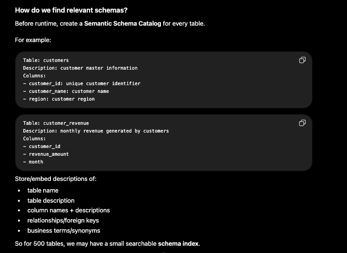
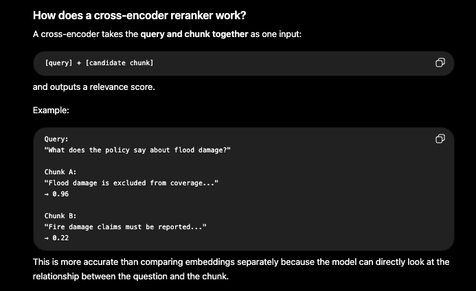
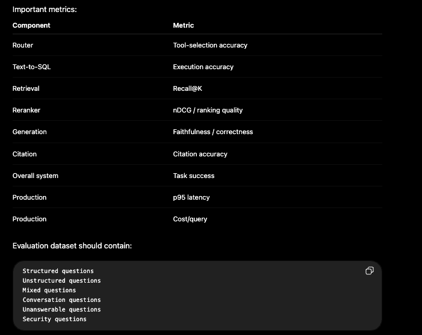

### This is for applied AI engineering.

Something similar has been designed in this AWS article: https://aws.amazon.com/blogs/machine-learning/boosting-rag-based-intelligent-document-assistants-using-entity-extraction-sql-querying-and-agents-with-amazon-bedrock/

## Designing a RAG System for Structured and Unstructured Data

#### Problem Statement

Design an enterprise question-answering system that can answer questions using:

- Structured Data: relational tables with proper columns and relationships
- Unstructured Data: PDFs, DOCX files, Excel workbooks, text files, scanned documents, and similar sources

The system should be reliable, secure, scalable, and able to answer questions that require information from either or both source types.

#### Functional Requirements

The system should:

- Answer questions from structured data.
- Answer questions from unstructured documents (data).
- Answer questions requiring both.
- Support follow-up questions.
- Return citations/sources.

#### Non-functional Requirements

Focus only on the important ones:

- Low latency: p95 under 8–10 seconds
- Scalability: query and ingestion workloads should scale independently
- Reliability: recovery if the agent/server crashes
- Security: multi-tenant and secure
- Grounding: answers should be grounded in evidence

> [!NOTE]
> #### Ingestion and Storage Prerequisite
>
> Before the system can answer a question, the source data must be ingested, processed, and stored in a form that the retrieval services can query. Ingestion is therefore a prerequisite for the query-serving path, even though the two workloads should scale independently.
>
> - Structured data is extracted and normalized into PostgreSQL, where the structured query service can retrieve it using SQL.
> - Unstructured data is extracted (using OCR when required), chunked, embedded, and indexed in OpenSearch, where the unstructured query service can retrieve it using hybrid search.
> - Document metadata such as `document_id`, version, content hash, `tenant_id`, and ingestion status is maintained so that updates are idempotent, traceable, and access-controlled.
>
> The complete ingestion flow—including S3 events, SQS, the ingestion worker, content routing, version handling, and storage—is described in [RAG System Prerequisites: Ingestion Pipeline](003-RAG-systems-prerequisites.md).

Once ingestion is complete, the query orchestrator can retrieve evidence from PostgreSQL, OpenSearch, or both, depending on the question.

Internally the orchestrator is going to interact with 3 main tools:

- `StructuredQueryTool`
- `UnstructuredQueryTool`
- `EvidenceFusionTool`

`EvidenceFusionTool` combines results from the structured and unstructured paths into a single evidence set before sending it to the LLM.

#### High-Level Design


##### Query Flow

- Suppose the user asks: Which customers with revenue above 1 crore are complaining about onboarding delays?
- The request enters, and the flow will be something like:
  - User -> API Gateway -> Authentication/Authorization -> Query Orchestrator
  - At this point, we resolve things like `user_id`, `tenant_id`, roles, and `conversation_id`.

###### Query Orchestrator

- This is the brain coordinating everything.
- First, it loads the relevant conversation history, and we can use a NoSQL database like DynamoDB here.
- Then its **planner/router** determines the route (we would be using an LLM in the planner/router):
  - `STRUCTURED_ONLY`: whether we need to have only a structured path (based on the user's query) -> for example, the query is: How many customers purchased product A?
  - `UNSTRUCTURED_ONLY`: whether we need to have only an unstructured path -> for example, the query is: What does our refund policy say?
  - `MIXED_PARALLEL`: whether the unstructured and structured paths can run in parallel -> the query here could be: What was the revenue last year, and what does our refund policy say? -> here, both paths can run in parallel.
  - `MIXED_DEPENDENT`: whether the structured and unstructured paths depend on each other -> for example, the query could be: Find customers earning more than one crore and summarise their complaints.
  - `CLARIFICATION_REQUIRED`

###### Path of Structured Query Service

- Suppose the structured query is: Find the customers with annual revenue above 1 crore.
- The flow is:

```text
Question -> Find the relevant schemas -> Generate SQL -> Validate SQL -> Execute SQL -> Return structured evidence
```

- Finding relevant database schemas means that we don't send the schemas of all 500 tables to the LLM. Instead, we need to maintain a **semantic schema catalog**:

  

- Now, if there is a question, we need to convert that question into an embedding -> then find relevant tables and their columns and send them to the LLM to generate the SQL for us.
- But we do not want to execute that generated SQL directly. We need to validate that SQL:
  - Only `SELECT` (we are doing only "read")
  - It only contains allowed tables and allowed columns
  - The `tenant_id` condition should be present, etc.
- Then it must return a proper JSON response like this:

```json
[
  {
    "customer_id": "C101",
    "customer_name": "ABC Ltd",
    "annual_revenue": 14000000
  },
  {
    "customer_id": "C208",
    "customer_name": "XYZ Ltd",
    "annual_revenue": 12500000
  }
]
```

###### Path of Unstructured Query Service

The flow of retrieval in the case of an unstructured query would be like this:

```text
Question -> question embedding (we are converting the question into an embedding here) -> metadata filtering -> hybrid search (keyword + semantic search) -> RRF / score fusion -> Top ~30 chunks -> Reranker -> Top ~5–10 chunks
```

**Why hybrid search?**

- Vector search is good for finding data based on meaning and context rather than exact word matches.
- But keyword search is good for discovering exact words and phrases.
  - For example, keyword search would be good for customer IDs (like `C001` and `C002`—because it wouldn't make any sense to use vector search), errors like `AUTH_928`, and products like iPhone 15—all these things wouldn't make much sense to search for using vector search; therefore, keyword search plays an important role here.
  - After BM25 (keyword search) + vector search -> we combine the results using RRF (reciprocal rank fusion) -> then use a reranker.
- It's stronger than vector-only retrieval.

**What is metadata filtering?**

- Metadata filtering means restricting the searchable chunks, before or during vector/keyword search, using non-vector fields attached to each chunk.
- Example chunk stored in OpenSearch:

```json
{
  "text": "customer reported a delay during onboarding.",
  "embedding": [...],
  "tenant_id": "T1",
  "customer_id": "C101",
  "document_type": "complaint",
  "region": "India",
  "document_id": "DOC-102",
  "year": 2026
}
```

- Now, if the question is: Show onboarding complaints for customer `C101` from the year 2026.
  - Here, instead of searching all chunks, we apply filters like:
    - `tenant_id`
    - `customer_id`
    - `year`
  - Then, run keyword/vector search only on the allowed subset.

**So, metadata filtering will be important for security (tenant A would never search tenant B's data), accuracy (avoids irrelevant chunks), and speed (reduces the search space).**

###### Reranking of Returned Chunks

- Vector search might return 30 chunks.
- But this stage is optimised for speed.

```text
User Query -> BM25 + vector search -> Top 30 candidates
```

- Those 30 are "probably relevant," but their order may not be perfect.
- Then the reranker scores each carefully:

```text
Query + chunk 1 -> score 0.93
Query + chunk 2 -> score 0.41
Query + chunk 3 -> score 0.88
...
```

- Then we sort by score and keep only the top 7 chunks (`top-k` chunks).
- The most common reranker is a cross-encoder reranker.
- This is how a cross-encoder reranker works:



- A cross-encoder takes the **query and the chunk together** as one input and outputs a relevance score:

```text
[query] + [candidate chunk]
```

- A cross-encoder reranker is still a language model, usually a smaller transformer model. It's just not a large generative LLM like GPT/Claude.
- A cross-encoder is a small transformer trained specifically for relevance scoring. It jointly processes the query and candidate chunk using attention and outputs a relevance score instead of generating text, which is why it can rerank retrieved chunks more accurately.
  - "Using attention" in the above statement means that it can directly compare words/tokens in the query with the words/tokens in the chunk and learn which parts are related.

###### Context Builder

- Once we have evidence, we should not simply dump everything into the LLM.
- The context builder decides:
  - Which evidence to include
  - What to remove
  - Which conversation history to include (include relevant history)
  - Source/citation IDs
  - How to format everything into a clean prompt

###### LLM Gateway

- The context builder sends that prompt to the LLM gateway.
- The gateway then calls Amazon Bedrock, OpenAI, or another model.
- This same gateway could also be used for the following (possibly with different models):
  - Query planning (planner/executor of the query orchestrator)
  - Text-to-SQL (in the structured query path)
  - Final response generation (through the LLM gateway in the end)

- Before returning the response, we have to validate it using a **validator**, which will check whether any sensitive information is exposed, whether there is sufficient evidence, whether the response format is valid, etc.
  - If the evidence is insufficient, we can return, "I couldn't find enough evidence to answer confidently." This is better than hallucinating.

###### Conversation Memory

- It could be a NoSQL store.
- It stores full message history, recent messages, summaries of old messages, important entities, etc.

###### What if the Agent Server Crashes?

- This is a very important applied AI question.
- Don't store the agent execution state only inside Python's memory.
- We have to persist the following in PostgreSQL/DynamoDB:
  - Execution ID
  - Plan
  - Completed steps
  - Tool results
  - Current step

- For example, the agent is running, planning is completed, and the structured query is completed, but it fails at document retrieval.
- When another ECS task starts:
  - It can load the checkpoint
  - It can recognize that the structured query is already completed
  - It can resume from document retrieval

###### Scaling the Query System (How to Scale Different Parts of Our Architecture)

1. Query Orchestrator
   - Run multiple stateless ECS Fargate tasks behind a load balancer
   - Scale based on:
     - Memory
     - CPU
     - Latency
     - Requests/sec

2. PostgreSQL
   - Use:
     - Read replicas
     - Indexing
     - Connection pooling
     - Caching

3. OpenSearch
   - For millions/billions of vectors:
     - HNSW ANN (approximate nearest neighbour) indexes
     - Sharding
     - Tenant filtering
     - Metadata filtering

4. LLM
   - Control:
     - Concurrency
     - Rate limits
     - Retries
     - Caching
     - Fallback models

###### Evaluation (Very Important Applied AI Follow-Up)

- Don't just evaluate the final answer.
- Evaluate: routing (planning and routing) -> SQL -> retrieval -> reranking -> final answer.
- These could be the important metrics:



- We need to use:
  - Deterministic evaluation
  - LLM-as-a-judge
  - Human evaluation
