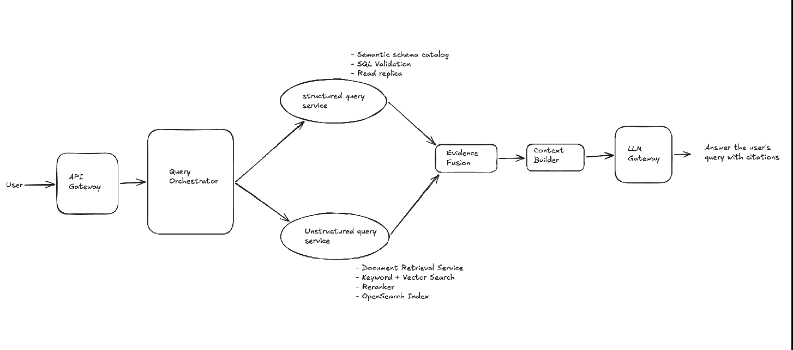

### This is for applied AI engineering.
Here over AWS link, something similar has been designed: https://aws.amazon.com/blogs/machine-learning/boosting-rag-based-intelligent-document-assistants-using-entity-extraction-sql-querying-and-agents-with-amazon-bedrock/

## Designing a RAG System for Structured and Unstructured Data

#### Problem Statement

Design an enterprise question-answering system that can answer questions using:

- Structured Data: relational tables with proper columns and relationships
- Unstructured Data: PDFs, DOCX files, Excel Workbooks, text files, scanned documents, and similar sources

The system should be reliable, secure, scalable, and able to answer questions that require information from either or both source types.

#### Functional Requirements

The system should:

- Answer questions from structured data.
- Answer questions from unstructured documents (data).
- Answer questions requiring both.
- Support follow up questions.
- Return citations/sources.

#### Non-functional Requirements

Focus only on the important ones:

- Low Latency: p95 response within approximately 8-10 seconds
- Scalability: query and ingestion workloads should scale independently
- Reliability: agent execution should survive server crashes
- Security: users should only retrieve authorized rows and documents
- Answer quality: responses should be grounded and cited
- Freshness: structured data should be near real-time; document indexing can be eventually consistent

#### Core Entities

- User
- Conversation
- Data Source
- Documents: represents an uploaded file
- Document chunk: represent the indexed portion of the document
- Query Execution: stores the current agent workflow
- Evidence: represents SQL results or retrieved document chunks
- Agent Checkpoint: enables crash recovery

#### APIs and Interfaces

1. `POST /queries` — Ask a question.
2. `POST /documents` — Upload or register a document.
3. `GET /documents/{document_id}/status` — Check whether ingestion is complete.

#### Ingestion and Storage Prerequisite

Before the system can answer a question, the source data must be ingested, processed, and stored in a form that the retrieval services can query. Ingestion is therefore a prerequisite for the query-serving path, even though the two workloads should scale independently.

- Structured data is extracted and normalized into PostgreSQL, where the structured query service can retrieve it using SQL.
- Unstructured data is extracted (using OCR when required), chunked, embedded, and indexed in OpenSearch, where the unstructured query service can retrieve it using hybrid search.
- Document metadata such as `document_id`, version, content hash, `tenant_id`, and ingestion status is maintained so that updates are idempotent, traceable, and access-controlled.

The complete ingestion flow—including S3 events, SQS, the ingestion worker, content routing, version handling, and storage—is described in [RAG System Prerequisites: Ingestion Pipeline](003-RAG-systems-prerequisites.md).

Once ingestion is complete, the query orchestrator can retrieve evidence from PostgreSQL, OpenSearch, or both, depending on the question.

Internally the orchestrator is going to interact with 3 main tools:

- `StructuredQueryTool`
- `UnstructuredQueryTool`
- `EvidenceFusionTool`

`EvidenceFusionTool` combines results from the structured and unstructured paths into a single evidence set before sending it to the LLM.

#### High-Level Design



> **Note:** This is the initial version of the high-level design. We will refine it as we work through the system.

- Structured data in PostgreSQL should be queried using SQL, while unstructured data indexed in OpenSearch should be retrieved using hybrid search. An orchestrator decides which path to use. This is the key design principle.
- **Point 1:** both services do not always execute in parallel.
  - **For an independent mixed question, both services can run in parallel.**
    - The meaning of an independent mixed question is—consider this: What was last quarter's revenue, and what does the policy say about refunds?
    - Here, both can run in parallel (the structured query service and the unstructured query service can both run in parallel).
  - But consider: Find customers with revenue above 1 crore and summarise their complaints.
    - Here, the document search depends on customer IDs returned by SQL: **Structured Query -> Get customer IDs -> Document search filtered by customer IDs -> Evidence fusion**.
  - Therefore, here, the orchestrator must generate a small execution plan or DAG, not merely choose one or two services.
  - It should support:
    - STRUCTURED_QUERY
    - UNSTRUCTURED_QUERY
    - MIXED_PARALLEL
    - MIXED_DEPENDENT
    - CLARIFICATION_REQUIRED

- **Point 2:** The orchestrator itself needs access to an LLM.
  - The orchestrator cannot intelligently decide the route by itself unless routing is rule-based.
  - For complex queries, it normally calls a planning model through the LLM gateway:
    Question -> Planner prompt sent through LLM gateway -> structured execution plan
  - **This planner call is important in the diagram.**
  - It can return structured JSON, something like this:

  ```json
  {
    "query_type": "MIXED_DEPENDENT",
    "steps": [
      {
        "id": "step_1",
        "tool": "structured query",
        "task": "Find customers with revenue above 1000000"
      },
      {
        "id": "step_2",
        "tool": "document search",
        "task": "Find complaints for returned customers",
        "depends_on": ["step_1"]
      }
    ]
  }
  ```

- **Point 3: Evidence Fusion and Context Builder Need Not Be Separate Services**
  - These are important logical components for our service, but at least initially, they do not need separate services.
  - We are going to call these services after our tool calling, so they can actually be placed inside the query orchestrator service.
    - So, the query orchestrator will first plan -> tool executor -> then evidence fusion -> context builder -> execution state manager
  - We should make separate microservices only when:
    - The computational cost of any logic has become very high (for example, fusion logic becomes computationally heavy).
    - Multiple applications reuse them.
    - Different teams own them, etc.


