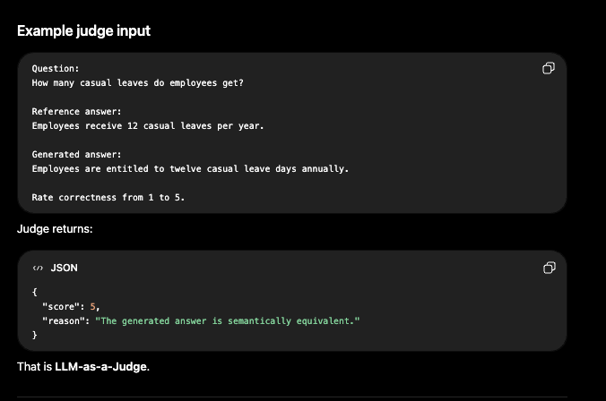

- Never evaluate a RAG system only by looking at the final answer. Evaluate every stage independently.

- We have to evaluate each and every step independently and not only the final answer.

```text
Question -> Planning/Routing -> Retrieval/SQL -> Reranking -> Context Building -> LLM Generation -> Citations -> Final Answer
```

- AWS makes the same distinction in its RAG evaluation system: it supports **retrieve-only evaluation** separately from **retrieve-and-generate evaluation**. [AWS Docs - Evaluate the performance of RAG](https://docs.aws.amazon.com/bedrock/latest/userguide/evaluation-kb.html)

- Start with a golden evaluation dataset.
  - Before choosing RAGAS or LLM-as-a-judge, we need a dataset representing what "correct" means.

- For an HR chatbot, one example of a golden dataset could be:

```json
{
  "question": "How many casual leaves do employees get per year?",
  "expected_answer": "Employees receive 12 casual leaves per year.",
  "expected_documents": ["leave_policy_2026.pdf"],
  "expected_chunk_ids": ["leave_policy_2026_chunk_12"],
  "expected_route": "UNSTRUCTURED_ONLY"
}
```

For a structured question:

```json
{
  "question": "How many employees joined in August 2026?",
  "expected_answer": "37 employees",
  "expected_route": "STRUCTURED_ONLY",
  "expected_sql_result": 37
}
```

For mixed RAG:

```json
{
  "question": "Which employees joined this month and have not submitted the documents required by onboarding policy?",
  "expected_route": "MIXED_DEPENDENT",
  "expected_employee_ids": ["E101", "E304"],
  "expected_documents": ["onboarding_policy.pdf"]
}
```

- Your evaluation set should contain:
  - Normal questions
  - Difficult questions
  - Structured-only questions
  - Unstructured-only questions
  - Ambiguous questions
  - Mixed questions
  - Questions with no answer
  - Multi-turn questions

- **Start manually with maybe 50–100 high-quality examples, then grow it using production failures. LangSmith similarly recommends starting from carefully curated examples and later adding production traces, user feedback, and edge cases.** Check this out: [LangChain Docs - Evaluation concepts](https://docs.langchain.com/langsmith/evaluation-concepts)

---

The clean way to understand RAG evaluation is to take one simple application and see exactly where each evaluation method fits.

Assume our HR chatbot (which is answering from internal HR documents) works like this:

```text
HR Policy PDFs -> Chunks + Embeddings -> Vector DB
User question -> Retriever -> Top K Chunks -> LLM -> Final answer
```

**Now we evaluate the system at different stages.**

#### What is deterministic evaluation?

Deterministic evaluation means evaluation using normal code/rules—without using an LLM.
The input is the same -> the result is always the same.

For example:

```python
expected = 12
actual = 12

print(expected == actual)
# True
```

- There is no AI deciding whether it is correct.

##### Where do we use deterministic evaluation in our HR chatbot?

We mainly use it where we already know what correct means.

**A. Retrieval Evaluation**

- Suppose, for a question, we already know the correct policy chunk is `leave_policy_chunk_18`.
- Now, the retriever returns:
  1. `leave_policy_chunk_20`
  2. `holiday_policy_chunk_4`
  3. `leave_policy_chunk_18`
  4. `salary_policy_chunk_8`
  5. `leave_policy_chunk_21`

- We can deterministically calculate `Recall@5`—because the expected chunk appeared in the top 5. No LLM is needed.

**B. Exact Answer Evaluation**

- For structured query answers, exact answer evaluation can work. For example, if the question is, "How many casual leaves?"
- If the expected answer for this is 12 and the actual answer is 12, then we can compare directly.
- But it won't work for answers like this:
  - Expected: Employees get 12 casual leaves every year.
  - Actual: Every employee is entitled to 12 casual leave days annually.
- Those mean the same thing, but the strings are different, so an LLM-as-a-judge would be better here.

**C. Citation Validation**

- The generated answer is: Employees get 12 casual leaves. `[chunk_18]`
- We can check:

```python
retrieved_chunks = {
    "chunk_18",
    "chunk_21",
    "chunk_42",
}

citation = "chunk_18"

print(citation in retrieved_chunks)
# True
```

- Or we can also check whether the actual citation is equal to the expected citation (if we know what would be the actual citation for this kind of answer).
- Again, no LLM is needed.

**D. Other deterministic checks**

- Latency < 5 seconds?
- Response validation?
- Correct tenant retrieved?
- No empty answer?
- Correct document version?
- Citation exists?

**I use deterministic evaluation where correctness can be measured objectively—for example, citation validation, retrieval `Recall@K`, exact SQL/database results, latency, security filters, known numeric answers, etc.**

#### LLM-as-a-Judge?

- Some things cannot be measured with normal code.
- Again, if we use the example given above:
  - Question: How many leaves do employees get?
  - Reference: Employees get 12 casual leaves every year.
  - Generated: Employees are entitled to 12 casual leave days annually.
  - Exact string comparison here will say, "Different ❌," but clearly the answer is correct.
  - So, we ask another LLM to evaluate it.


