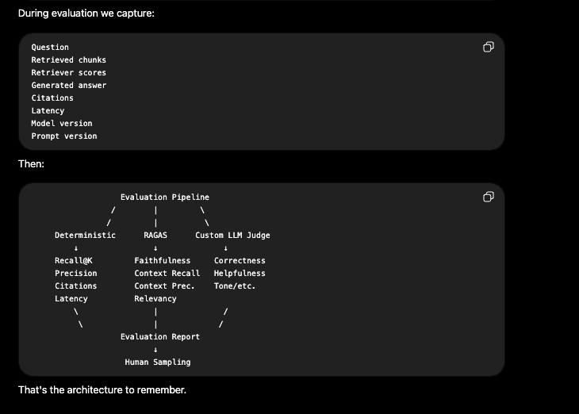

- Never evaluate a RAG system only by looking at the final answer. Evaluate every stage independently.

- We have to evaluate each and every step independently and not only the final answer.

```text
Question -> Planning/Routing -> Retrieval/SQL -> Reranking -> Context Building -> LLM Generation -> Citations -> Final Answer
```

- AWS makes the same distinction in its RAG evaluation system: it supports **retrieve-only evaluation** separately from **retrieve-and-generate evaluation**. [AWS Docs - Evaluate the performance of RAG](https://docs.aws.amazon.com/bedrock/latest/userguide/evaluation-kb.html)

- Start with a golden evaluation dataset.
  - Before choosing RAGAS or LLM-as-a-judge, we need a dataset representing what "correct" means.

- For an HR chatbot, one example of a golden dataset could be:

```json
{
  "question": "How many casual leaves do employees get per year?",
  "expected_answer": "Employees receive 12 casual leaves per year.",
  "expected_documents": ["leave_policy_2026.pdf"],
  "expected_chunk_ids": ["leave_policy_2026_chunk_12"],
  "expected_route": "UNSTRUCTURED_ONLY"
}
```

For a structured question:

```json
{
  "question": "How many employees joined in August 2026?",
  "expected_answer": "37 employees",
  "expected_route": "STRUCTURED_ONLY",
  "expected_sql_result": 37
}
```

For mixed RAG:

```json
{
  "question": "Which employees joined this month and have not submitted the documents required by onboarding policy?",
  "expected_route": "MIXED_DEPENDENT",
  "expected_employee_ids": ["E101", "E304"],
  "expected_documents": ["onboarding_policy.pdf"]
}
```

- Your evaluation set should contain:
  - Normal questions
  - Difficult questions
  - Structured-only questions
  - Unstructured-only questions
  - Ambiguous questions
  - Mixed questions
  - Questions with no answer
  - Multi-turn questions

- **Start manually with maybe 50–100 high-quality examples, then grow it using production failures. LangSmith similarly recommends starting from carefully curated examples and later adding production traces, user feedback, and edge cases.** Check this out: [LangChain Docs - Evaluation concepts](https://docs.langchain.com/langsmith/evaluation-concepts)

---

The clean way to understand RAG evaluation is to take one simple application and see exactly where each evaluation method fits.

Assume our HR chatbot (which is answering from internal HR documents) works like this:

```text
HR Policy PDFs -> Chunks + Embeddings -> Vector DB
User question -> Retriever -> Top K Chunks -> LLM -> Final answer
```

**Now we evaluate the system at different stages.**

#### What is deterministic evaluation?

Deterministic evaluation means evaluation using normal code/rules--without using an LLM.
The input is the same -> the result is always the same.

For example:

```python
expected = 12
actual = 12

print(expected == actual)
# True
```

- There is no AI deciding whether it is correct.

##### Where do we use deterministic evaluation in our HR chatbot?

We mainly use it where we already know what correct means.

**A. Retrieval Evaluation**

- Suppose, for a question, we already know the correct policy chunk is `leave_policy_chunk_18`.
- Now, the retriever returns:
  1. `leave_policy_chunk_20`
  2. `holiday_policy_chunk_4`
  3. `leave_policy_chunk_18`
  4. `salary_policy_chunk_8`
  5. `leave_policy_chunk_21`

- We can deterministically calculate `Recall@5`—because the expected chunk appeared in the top 5. No LLM is needed.

**B. Exact Answer Evaluation**

- For structured query answers, exact answer evaluation can work. For example, if the question is, "How many casual leaves?"
- If the expected answer for this is 12 and the actual answer is 12, then we can compare directly.
- But it won't work for answers like this:
  - Expected: Employees get 12 casual leaves every year.
  - Actual: Every employee is entitled to 12 casual leave days annually.
- Those mean the same thing, but the strings are different, so an LLM-as-a-judge would be better here.

**C. Citation Validation**

- The generated answer is: Employees get 12 casual leaves. `[chunk_18]`
- We can check:

```python
retrieved_chunks = {
    "chunk_18",
    "chunk_21",
    "chunk_42",
}

citation = "chunk_18"

print(citation in retrieved_chunks)
# True
```

- Or we can also check whether the actual citation is equal to the expected citation (if we know what would be the actual citation for this kind of answer).
- Again, no LLM is needed.

**D. Other deterministic checks**

- Latency < 5 seconds?
- Response validation?
- Correct tenant retrieved?
- No empty answer?
- Correct document version?
- Citation exists?

**I use deterministic evaluation where correctness can be measured objectively—for example, citation validation, retrieval `Recall@K`, exact SQL/database results, latency, security filters, known numeric answers, etc.**

#### LLM-as-a-Judge?

- Some things cannot be measured with normal code.
- Again, if we use the example given above:
  - Question: How many leaves do employees get?
  - Reference: Employees get 12 casual leaves every year.
  - Generated: Employees are entitled to 12 casual leave days annually.
  - Exact string comparison here will say, "Different ❌," but clearly the answer is correct.
  - So, we ask another LLM to evaluate it.


##### Where do we use LLM-as-a-Judge?

- For semantic qualities.

**Answer Correctness**

```text
Generated answer -> Reference answer
```

- Did it give the right answer?

**Faithfulness**

```text
Generated answer -> Retrieved context
```

- Did it say anything that isn't present in the evidence?
- For example:
  - Example context: Employees get 12 casual leaves.
  - Generated answer: Employees get 12 casual leaves and 20 sick leaves.
  - Judge:
    - 12 casual leaves: supported
    - 20 sick leaves: unsupported
- Faithfulness is low.

**Answer Relevance**

Suppose the question is: How many casual leaves do employees get?

And the answer is: Our company was founded in 2011, and employees receive 12 casual leaves...

- Technically correct but unnecessarily irrelevant.
- The judge can detect this.

#### Then what exactly is RAGAS?

- There is one important distinction here: RAGAS is an evaluation framework. LLM-as-a-judge is an evaluation technique.
- RAGAS already implements useful RAG metrics for you. It may itself use an LLM internally for some evaluations.
- So, these are not necessarily three completely separate alternatives:
  - Deterministic evaluation
  - LLM-as-a-judge
  - RAGAS
- RAGAS may internally do: RAGAS -> LLM-as-a-judge (for metrics such as faithfulness).

##### Important RAGAS metrics could be

**A. Context Recall**

- Suppose the question is: What are the maternity leave rules?
- And the answer requires: `chunk_10`, `chunk_11`, and `chunk_12`.
- The retriever finds `chunk_10` and `chunk_11` but misses `chunk_12`.
- Context recall becomes lower.
- Here, we need to check: Did retrieval find all the information needed to answer?

**B. Context Precision**

- For the same question, the retriever returns:
  - `chunk_10` ✅
  - `salary_chunk_8` ❌
  - `office_food_chunk_4` ❌
  - `chunk_11` ✅
  - `random_chunk_2` ❌
- Relevant information is there, but a lot of junk came with it.
- Context precision is poor.
- Here, we need to check: How much of the retrieved context is actually useful?

**C. Faithfulness:** same as above (it should not have irrelevant information).

**D. Answer Relevancy**

- Suppose the question is: Can casual leaves be carried forward?
- And the answer is: Employees receive 12 casual leaves per year.
- It may be true, but it doesn't answer the question, so answer relevancy is low here.

**E. Factual Correctness**

- The answer should be: Casual leaves cannot be carried forward.
- But the generated answer is: Casual leaves can be carried forward.
- Clearly incorrect.

#### Custom LLM Judge

- We can use a custom LLM judge for product-specific subjective/semantic quality.

This is the architecture we can follow:



#### Proper Algorithm for Evaluation

##### Step 1 -- Create Golden Dataset

- Question
- Expected answer
- Expected source/chunks

Example:

- Q: How many casual leaves?
- A: 12
- Relevant chunk: `chunk_18`

Maybe build 50–100 manually at first.

##### Step 2 -- Run RAG Pipeline

For every question, capture:

- Retrieved chunks
- Final context
- Generated answer
- Citations
- Latency
- Tokens

##### Step 3 -- Deterministic Evaluation

Calculate:

- `Recall@K` (did we find relevant chunks in the retrieved chunks?)
- `Precision@K` (how many of the retrived chunks are useful?)
- Citation validity
- Latency
- Security checks

##### Step 4 -- RAGAS

Calculate things like:

- Context Precision
- Context Recall
- Faithfulness
- Answer Relevancy
- Factual Correctness

##### Step 5 -- Custom LLM Judge

If your product has special requirements, add them.
For example, for HR:
> "Does this answer make an unsupported HR/legal recommendation?"
Or:
> "Is this answer clear enough for a normal employee?"

Those may not be standard RAGAS metrics.

##### Step 6 -— Human Review
Review a representative subset.

##### Step 7 —- Compare Against Previous Version
For example:
```text
                    v1       v2
Recall@5            0.91     0.95 ✅
Faithfulness        0.94     0.93 ~
Correctness         0.89     0.92 ✅
p95 latency         3.2s     4.7s ⚠️
Cost/query          $0.01    $0.02 ⚠️
```
Now you can make an informed deployment decision.

#### CI/CD Evaluation - this is where the full evaluation suite should run.
- If quality fails below your threshold then block the deployment.