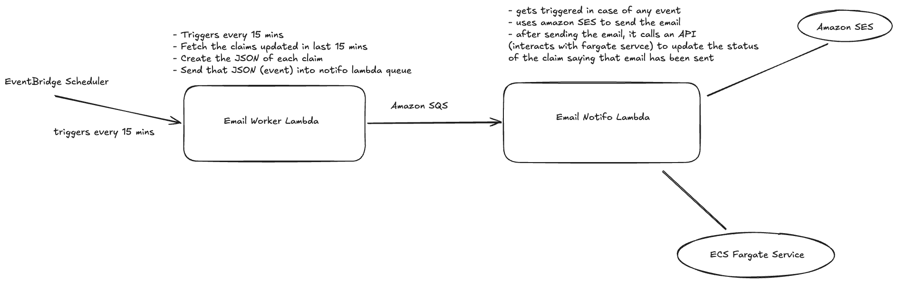

# Event-Driven Architecture



- The entire system is not event-driven. The producer is **schedule-driven** because EventBridge Scheduler invokes the worker every 15 minutes.
- From SQS to the Notifo Lambda function, the pipeline becomes event-driven.
- Describing it as a **scheduled producer feeding an event-driven pipeline** is technically more accurate.
- The main reasons for using SQS with two Lambda functions are decoupling, buffering, independent scaling, and failure isolation.

## Why Do We Use a Queue at All?

Forget AWS for a moment. Whether the underlying technology is SQS, RabbitMQ, or Kafka, the basic purpose is the same:

- A queue sits between a producer and a consumer so that they don't have to process work at the same time or at the same speed.

In our case:

```text
Worker Lambda (producer) -> SQS -> Notifo Lambda (consumer)
```

Without a queue:

```text
Worker Lambda -> Notifo Lambda
```

The two Lambda functions are directly dependent on each other.

With a queue:

```text
Worker Lambda -> SQS -> Notifo Lambda
```

The two Lambda functions are now decoupled.

### Main Benefits of Using a Queue

1. **Decoupling:** Worker Lambda does not need to know whether Notifo Lambda is available at that moment.
2. **Buffering:** Suppose Worker Lambda suddenly creates 20,000 notification events.

   ```text
   20,000 events -> SQS -> Notifo Lambda processes them at its own rate
   ```

   SQS absorbs the spike.

3. **Independent Scaling:** As the queue backlog grows, AWS can run more Notifo Lambda invocations without scaling Worker Lambda.
4. **Retries:** Failed messages can be retried automatically.
5. **Backpressure:** If downstream processing is slower than incoming traffic, the queue holds the backlog instead of overwhelming the service.

### Why Not Invoke Notifo Lambda Asynchronously—and Why Use SQS?

An asynchronous Lambda invocation would remove the need for Worker Lambda to wait for Notifo Lambda, but SQS provides additional guarantees and controls that direct invocation does not naturally provide.

With direct asynchronous invocation:

```text
Worker Lambda -> Asynchronous invocation -> Notifo Lambda
```

This provides asynchronous execution.

With SQS:

```text
Worker Lambda -> SQS -> Notifo Lambda
```

This additionally provides buffering, retries, backpressure, delayed message delivery, dead-letter queue (DLQ) support, and independent scaling.

**We did not introduce SQS solely for asynchronous execution. We introduced it because we needed a durable buffer between the producer and consumer.**

### How Do We Handle Failures?

We can keep it simple:

```text
SQS -> Notifo Lambda -> Processing fails -> Message remains in the queue
    -> Visibility timeout expires -> Retry -> Repeated failures -> DLQ
```

#### Important Note

"Becomes visible again" refers to the **SQS visibility timeout**.

When Lambda receives an SQS message, SQS does not immediately delete it. Instead, SQS temporarily hides the message so another Lambda invocation cannot process it simultaneously. If processing succeeds, Lambda deletes the message. If processing fails, the message becomes visible again after the visibility timeout expires.

The detailed failure flow is:

```text
SQS message
    ↓ Received by Lambda
Temporarily hidden
    ↓
Lambda processing fails
    ↓
Message remains in the queue
    ↓ Visibility timeout expires
Message becomes visible in SQS again
    ↓
Lambda retries
```

If processing continues to fail and a redrive policy is configured, SQS moves the message to a dead-letter queue according to the configured `maxReceiveCount`. The message can later be redriven from the DLQ back to the source queue.

Lambda automatically deletes the message when processing succeeds.

The message-deletion flow is:

```text
SQS sends the message -> Lambda processes it successfully
                      -> Lambda deletes the SQS message

SQS sends the message -> Lambda throws an error or times out
                      -> Message remains in the queue
                      -> Visibility timeout expires
                      -> Message becomes visible and is retried

Repeated failures -> SQS moves the message to the DLQ according to the redrive policy
```

#### What If SES Fails?

- If an SES request fails immediately—for example, because of throttling, invalid parameters, missing permissions, or an SES service error—the Lambda function propagates the exception and reports a failure. SQS then retries the message.
- If SES accepts the email but delivery fails later, SQS does not retry the message because the original processing succeeded.

#### DLQ and Redrive

After a message exceeds the configured `maxReceiveCount`, SQS moves it to the DLQ. The message can later be redriven from the DLQ back to the source queue.

#### How Do We Handle SES Bounces?

Configure SES event publishing to SNS, EventBridge, or another supported destination.

The flow is:

```text
SQS -> Notifo Lambda -> SES
                         ↓
               Email outcome event
                         ↓
          EventBridge default event bus
                         ↓
                  Matching rule
                         ↓
                 Feedback Lambda
                         ↓
      Update database / alert / suppress email
```
